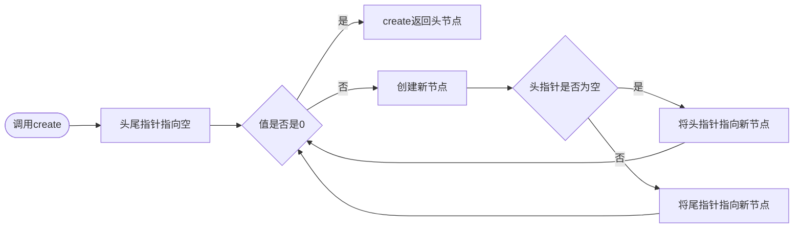

# C\+\+

嫌麻烦可以看飞书

> https://rcns607y2xyb.feishu.cn/docx/U66mdtFbvoB1JoxYAxrczCQ5nac?from=from_copylink

## 前言

我的C++老师是**黄小兵老师**，这些笔记都是上课的时候随手写下来的所以可能有些小纰漏（？

顺便吹一下牛逼，本人**~~很不幸~~**C++满绩(90分及以上)

## 杂记

machine language,assembly language and high\-level language

machine language\(机器语言\)：由0和1构成，是机器唯一能直接读懂的语言，但是人很难读懂

assembly language\(汇编语言\)：有点低级的语言，稍微改进了机器语言，使人能够读懂，但是还是需要比较高的门槛

high\-level language\(高级语言\)：例如java，cpp等编程语言，离人更近，但是离机器更远了，更偏向于日常使用的英语，能够使用单个语句执行复杂任务，使用编译器\(compiler\)将高级语言翻译成机器语言，但这会消耗计算机的多次计算

hexadecimal十六进制\(H\)

decimalism十进制\(D\)

binary二进制\(B\)

### 截取字符串中的某一段

substr\(pos,n\)函数用于从字符串的pos位置提取n个字符的拷贝，原字符串不会被修改

### Setw \& Setfill

`setw` 和 `setfill` 都是C\+\+的流操纵器，需要包含头文件 `<iomanip>`。它们的核心区别在于：

- `setw`（设置宽度）：规定下一个输出的最小字符数。它是一次性的，仅对紧随其后的下一次输出有效。

- `setfill`（设置填充）：规定当输出内容宽度不足时，用来填充空白的字符。它是持久性的，设置后会一直有效，直到被重新设置。

```C++
#include <iostream>
#include <iomanip>
using namespace std;

int main() {
    cout << setfill('*'); // 设置填充字符为 *，永久有效

    // 仅对第一个“123”有效
    cout << setw(6) << 123 << " End" << endl;

    // setw(0) 或缺省 setw，表示无宽度限制
    cout << 456 << " End" << endl;

    // 重新设置宽度为 6
    cout << setw(6) << 789 << " End" << endl;
    return 0;
}
```

## 三元操作符

E1？E2：E3

E1为判断条件，E2E3为值

若E1为真，则结果为E2，反之为E3

例如输出a,b中的最大值

cout \<\< \( a \>= b ? a : b \) \<\< endl ;

三元操作符允许嵌套，例如给成绩分等级

这个操作类似于if\.\.\.else语句：

```C++
if ( E1 ){
    E2;
}else{
    E3;
}//此处的大括号\{\}用于表示E2/E3的内容，否则if管不到那么多行
```

一组if\.\.\.else语句的运行速度会比多个if叠加要快，因为if条件满足了就不会执行else语句了

## postincrement \& preincrement算后增量与算前增量

声明c=5

输出\+\+c为6（先\+\+后输出）

输出c\+\+为5（先输出后\+\+）

注意了这里算前算后单拎出来都是一个效果（如果不和其他东西运算的话）

实际上可以写\+\+x=3，说明算前增量可以做左值

## repetition structure 循环结构

```C++
while(E1){
    E2;
}
```

即当E1成立时执行E2，然后判断E1是否成立，若成立就继续执行E2

```C++
do{
    E2;
}while(E1)
```

区别在于在循环内容前判定条件还是在循环内容之后判定条件

for repetition statement

超级for循环是最常用的循环结构

```Plain Text
for( expression1 ; expression2 ; expression3 )
{ statements; }
```

for is keyword关键词

expression1 means initialization初始值

expression2 means loopContinuationCondition循环继续条件

expression3 means increment/decrement   自增/减

statement means loop body循环内容

具体流程：expression1定义初始值→expression2判断正误→执行循环内容→执行expression3完成自增/减

注意了这里的initialization是局部变量，只能在这个for循环内使用

例如从1累加至100的代码如下

```C++
#include<bits/stdc++.h>
using namespace std;
int main(){
    int sum = 0 ;
    for( int i = 1 ; i <= 100 ; i++ ){
        sum += i ;
    }
    cout<<sum<<endl;
}
```

当然这个expression1的初始化可以在循环外书写，这样就使得这个变量变成整体变量了

同理expression2和3都可以不写，但是要在循环内容内写跳出循环条件，不然就是死循环了

## Comma Operator

压缩代码方案，写法如下

```Plain Text
E1,E2,E3......En
```

表示从E1到En语句从左到右执行，可以用括号优先执行某一部分

```Plain Text
for(int i = 1;sum+=i++,i<=n;);
```

玛德这种写法纯反人类谁要是这么写我就一巴掌打过去，会使程序更加难读，难维护，难改，难测试

## break \& continue 终止和继续

执行break会直接离开它所在的控制结构

常用于强制跳出循环

执行continue会结束后续的循环内容

会直接进行下一次循环

## switch statement 选择结构

```Plain Text
switch (expression){
    case constant1 : statement1
    case constant2 : statement2
    case constant? : statement?
    default : statement
}
```

default相当于if\.\.\.else语句中的else

expression必须是个整形数据变量（表达式）

而当constant n与expression的数据\&数据类型相匹配则执行statement n

注意了statement n后面要以break结尾，否则会一路判断下去

举个例子

```C++
#include <iostream>
using namespace std;
int main (){
   char grade = 'D';
   switch(grade){
   case 'A' :
      cout << "很棒！" << endl; 
      break;
   case 'B' ://这里不写东西，当输入为B的时候会执行C的语句
   case 'C' :
      cout << "做得好" << endl;
      break;
   case 'D' :
      cout << "您通过了" << endl;
      break;
   case 'F' :
      cout << "最好再试一下" << endl;
      break;
   default :
      cout << "无效的成绩" << endl;
   }
   cout << "您的成绩是 " << grade << endl;
   return 0;
}
```

应当输出：您通过了/n您的成绩是 D

如果没有break：您通过了/n最好再试一下/n无效的成绩/n您的成绩是D

## Function 函数

函数适用于将代码modularize（模块化）

例如

```C++
#include<iostream>
using namespace std;
double vol();//函数的声明（原型prototype）
double vol(double radius,double height){
    return 3.14*radius*radius*height;
}//计算体积函数
int main(){
    double r,h;
    cin>>r>>h;
    cout<<vol(r,h);//调用函数
    return 0;
}
//计算圆柱体积
```

函数的结构

```C++
Data-type Function-name(Parameters){
    statement;
    return;
}
```

Data\-type：返回值的数据类型，如果没有就是void

Function\-name：用户自己设置的函数名

Patameters：输入函数的变量

注意了这里void函数表示没有返回值，例如交换两个数

```C++
void a(int a,int b){
    int temp=a;
    a=b;
    b=a;
    return;
}//说白了就是执行某一个步骤的函数
```

更搞的是void函数可以在return后面添加一个void函数

调用函数的结构

Function\-name\(Arguments\)

这个单独列一行在main之前可以作为函数的声明（原型prototypes）这样就算把函数的内容写在main之后都可以正常运行

这里的arguments和前面的parameters都是参数

但是parameters是形式参数（形参）（没有具体的值，参与运算的方式）

arguments是实际参数（实参）（有具体的值）

当function执行到最后的\}还没有碰到return或者return后面没有东西，则这个函数没有返回值

反之，如果执行了return expression;就是有返回值

这个函数是非常之牛逼的，在调用函数的时候会强制转换，就例如pfg\(double x\)函数里面是double类型，调用的时候输入的是int类型，那么仍然会正常执行\(Promotion了\)

啊啊但是要注意了这个转换只有没出现数据损失才可以实现，double转换成int就不行

规律是低级数据类型可以转换成高级数据类型，反过来不行（看字节数来决定高级还是低级）

注意上述说的是函数内置的转换，实际上你也可以在调用函数外进行强制转换再调用函数，当然这个报错了就是程序员的锅和编译器没关系

对了，声明函数必须在调用函数之前，否则会报错

### Argument Coercion 参数强迫

如果一个表达式中有多种数据类型，例如

'A' \+ 7 \+ 3\.88

编译器会将他转换成表达式中最高等级的类型（不损失数据）

### Reference Parameter 引用参数

在实际中我们会发现，函数内的变量似乎没法影响到函数外

```C++
#include <bits/c++.h>
using namespace std;
void exchange(int a,int b){
    int temp = a;
    a=b;
    b=temp;
}
int main(){
    int a=3,b=4;
    exchange(a,b);
    cout<<a<<b;
}//输出结果为34
```

对，问题就出在这里，x和y的value赋给了a和b，但是执行完exchange之后a和b没有传回给xy，这个就是pass\-by\-value，不会影响到原数值，至少复制过去而已

而pass\-by\-reference是传引用，表示传过去的数值与原数值同生共死

```C++
#include<iostream> 
using namespace std;
void myswap(int &a, int &b){
    int temp = a;
    a = b;
    b = temp;
}
int main(){
    int a = 1, b = 2;
    cout << "交换前：" << endl;
    cout << "a = " << a << ',';    
    cout << "b = " << b << endl;
    myswap(a, b);
    cout << "交换后：" << endl;
    cout << "a = " << a << ',';
    cout << "b = " << b << endl;
    return 0;
}
```

这时候函数里面的int \&a就是引用，代表这个a和外面输入的参数一起变化，这个属于是直接操控他的内存地址了，而不是简单的复制

但是这样也会引发一个问题，就是相当于把自己家的🔑给了别人让别人自己来改

### Function Templates 函数模板

我们经常性的会遇到一个函数需要被多种数据类型调用的情况，例如取最大值函数会被int，double，char用到，我们总不能重新写一堆函数，所以我们需要一个函数模板

```C++
template<typename T>
T max(const T a, const T b){
    return a>b ? a : b;
}
```

### Default Argument 默认实参

当函数未引用参数具体值的时候使用该值

就可以在函数声明的时候把值西进去，比如

int plus\(int a =1,int  b=1\)

这时候就算后面使用plus\(\)里面不加参数也不报错，而是将1，1代入运算

## C\+\+ Standard Library 希加加标准库

C\+\+ Standard Library包含了一大堆比较常用的函数（包含在头文件中）

头文件通常以\.h为结尾，但是已经被希加加标准库取代了

遇到一个功能应该先去找有没有标准库函数的功能与之匹配，然后bits/stdc\+\+\.h神力

### Random Number Generation 随机数生成

i = rand\(\);

随机生成一个从0到RAND\_MAX（一个\<cstdlib\>中的常数）的整数\(int\)

如果需要指定范围，则需要用到取模运算

a \+ rand\(\) % b;

表示随机生成一个从a到b\+a\-1的整数

这个就是伪随机数，如果只有一个rand的话默认种子为1，需要使用srand\(\)来使用不同的种子

诶，这时候一般都是要自己输入随机数种子的，那有没有一种办法来自动生成随机数种子呢？有的兄弟有的，我们可以套用一个time\(0\)来获取从1970年1月1日到现在经过的秒数（在\<ctime\>中的原型）作为随机数种子，这样每一秒的随机数都是不同的

## Enumeration 枚举

枚举的标准格式是

enum Months \{JAN =1 , FEB , MAR , APR\}

这大括号里面的数据依次为1，2，3，4

如果不写=1，则数据依次为0，1，2，3

没有指定的数据为前一项加一

然后这个Months可以作为一种变量类型

Months month;表示创建了一个Months类型的数据

举例如下：

```C++
#include <stdio.h>
 
enum DAY{
      MON=1, TUE, WED, THU, FRI, SAT, SUN
};
 
int main(){
    enum DAY day;
    day = WED;
    printf("%d",day);
    return 0;
}//输出3
```

## Storage Classes 存储类型

所有标识符都有对应的属性Name,type,size,value

C\+\+中给了五种提示符，\(auto,static比较常用，还有register,extern,mutable\)

Automatic storage class 自动存储类，用关键词\(auto,register\)声明

## auto 存储类

**auto** 存储类是所有局部变量默认的存储类。

定义在函数中的变量默认为 auto 存储类，这意味着它们在函数开始时被创建，在函数结束时被销毁。

\{
   int mount;
   auto int month;
\}

上面的实例定义了两个带有相同存储类的变量，auto 只能用在函数内，即 auto 只能修饰局部变量。

## register 存储类

**register** 存储类用于定义存储在寄存器中而不是 RAM 中的局部变量。这意味着变量的最大尺寸等于寄存器的大小（通常是一个字），且不能对它应用一元的 '\&' 运算符（因为它没有内存位置）。

register 存储类定义存储在寄存器，所以变量的访问速度更快，但是它不能直接取地址，因为它不是存储在 RAM 中的。在需要频繁访问的变量上使用 register 存储类可以提高程序的运行速度。

\{
   register int  miles;
\}

寄存器只用于需要快速访问的变量，比如计数器。还应注意的是，定义 'register' 并不意味着变量将被存储在寄存器中，它意味着变量可能存储在寄存器中，这取决于硬件和实现的限制。

static storage class 静态存储类，用关键词\(extern,static\)声明

## static 存储类

**static** 存储类指示编译器在程序的生命周期内保持局部变量的存在，而不需要在每次它进入和离开作用域时进行创建和销毁。因此，使用 static 修饰局部变量可以在函数调用之间保持局部变量的值。

static 修饰符也可以应用于全局变量。当 static 修饰全局变量时，会使变量的作用域限制在声明它的文件内。

全局声明的一个 static 变量或方法可以被任何函数或方法调用，只要这些方法出现在跟 static 变量或方法同一个文件中。

静态变量在程序中只被初始化一次，即使函数被调用多次，该变量的值也不会重置。

以下实例演示了 static 修饰全局变量和局部变量的应用：

```C++
#include <stdio.h>
/* 函数声明 */
void func1(void);
static int count=10;/* 全局变量 - static 是默认的 */
int main(){
  while (count--) {
      func1();}
  return 0;
}
void func1(void){
/* 'thingy' 是 'func1' 的局部变量 - 只初始化一次
 * 每次调用函数 'func1' 'thingy' 值不会被重置。*/                
  static int thingy=5;thingy++;
  printf(" thingy 为 %d ， count 为 %d\n", thingy, count);
}
```

实例中 count 作为全局变量可以在函数内使用，thingy 使用 static 修饰后，不会在每次调用时重置。

可能您现在还无法理解这个实例，因为我已经使用了函数和全局变量，这两个概念目前为止还没进行讲解。即使您现在不能完全理解，也没有关系，后续的章节我们会详细讲解。当上面的代码被编译和执行时，它会产生下列结果：

thingy 为 6 ， count 为 9
 thingy 为 7 ， count 为 8
 thingy 为 8 ， count 为 7
 thingy 为 9 ， count 为 6
 thingy 为 10 ， count 为 5
 thingy 为 11 ， count 为 4
 thingy 为 12 ， count 为 3
 thingy 为 13 ， count 为 2
 thingy 为 14 ， count 为 1
 thingy 为 15 ， count 为 0

## extern 存储类

**extern** 存储类用于定义在其他文件中声明的全局变量或函数。当使用 extern 关键字时，不会为变量分配任何存储空间，而只是指示编译器该变量在其他文件中定义。

**extern** 存储类用于提供一个全局变量的引用，全局变量对所有的程序文件都是可见的。当您使用 **extern** 时，对于无法初始化的变量，会把变量名指向一个之前定义过的存储位置。

当您有多个文件且定义了一个可以在其他文件中使用的全局变量或函数时，可以在其他文件中使用 *extern* 来得到已定义的变量或函数的引用。可以这么理解，*extern* 是用来在另一个文件中声明一个全局变量或函数。

extern 修饰符通常用于当有两个或多个文件共享相同的全局变量或函数的时候，如下所示：

**第一个文件：main\.c**

```C++
#include <stdio.h>
int count ;
extern void write_extern();
int main(){
   count = 5;write_extern();
}

```

**第二个文件：support\.c**

```C++
#include <stdio.h>
extern int count;
void write_extern(void){
   printf("count is %d\n", count);
}

```

在这里，第二个文件中的 *extern* 关键字用于声明已经在第一个文件 main\.c 中定义的 *count*。现在 ，编译这两个文件，如下所示：

$ gcc main\.c support\.c

这会产生 **a\.out** 可执行程序，当程序被执行时，它会产生下列结果：

count is 5

## File scope 文件作用域

全局变量的作用域为从声明到文件结束，局部变量的作用域为从声明到函数结束，在作用域内才能调用变量，局部作用域会隐藏掉全局作用域

```C++
int main(){
    int a = 3;
    {
    int a = 3;
    a++;
    cout<<a<<endl;//输出4
    }
    cout<<a<<endl;//输出3
}
```

上方例子可以看出在中间代码块中声明的a将外围的a隐藏掉了，独立进行运算

## Stack 栈

先进后出，后进先出是栈的基本存储方式，类似于堆盘子，上面的盘子后放，但是先被拿走

压栈就是将数据存入，出栈就是将数据弹出

## Recursion 递归

### 引入

在计算n的阶乘中我们注意到有

n\! = n \* \(n\-1\)\!

阶乘中还有一个阶乘，这就像是函数在运行中又调用了一次他自己

所以我们将这种函数调用自己的行为称为递归

### 具体做法

这就是阶乘的递归方法

```C++
int factorial(int a){
    if(a==1){
        return 1;
    }else{
        return a*factorial(a-1);
    }//调用了自己
}
```

看着会很烧脑

注意了，递归虽然是比较容易想到的方法，但是在解决某些问题的时候会很吃内存，例如计算斐波那契数列的f\(n\)=f\(n\-1\)\+f\(n\-2\)，每递归一次会调用两次原函数，复杂度会大大增加

### 使用递归解决实际问题

#### Towers of Hanoi

问题描述：现在有XYZ三座塔，有n个盘子堆叠在X上，从上到下依次增大，一次只能移动一个盘子，且规定小盘子只能放在大盘子上，求出将所有盘子移到Z上的最小次数

使用递归的思路，将问题化简：先将n\-1个盘子移动到Y上，再将第n个盘子移动到Z上，最后将n\-1个盘子移动到Z上。注意到当n=1时次数为1，故可以写出以下程序

```C++
#include <bits/stdc++.h>
using namespace std;
int Hanoi(int a){
    if(a==1){
        return 1;
    }else{
        return 2*Hanoi(a-1)+1;
    }
}
int main(){
    int n;
    cin>>n;
    cout<<Hanoi(n);
    return 0;
}

```

以上是输出总次数的办法，如果需要输出每一步是如何则需要使用void类型的函数

```C++
#include <bits/stdc++.h>
using namespace std;
void Hanoi(int a,char left, char middle,char right){
    if(a==1){
        cout<<left<<'to'<<right;
    }else{
        Hanoi(a-1,left,right,middle);//借助目标杆将n-1个盘子移动到中间杆
        cout<<left<<'to'<<right;//将第n个盘子移动到目标杆
        Hanoi(a-1,middle,left,right);//将中间杆上的n-1个盘子移动到目标杆
    }
    return;//回到上一次调用的地方
}
int main(){
    int n;
    cin>>n;
    Hanoi(n,'L','M','R');
    return 0;
}

```

## Array 数组

一堆带下标的数据

Datatype Identifier\[expression\]

是声明数组的方式，下标总是大于等于0

注意了这个数组是没有越界检查的，假如你的数组C只有12，但是调用C\[100\]时不会报错，而是顺着物理地址一路找到C\[100\]，就不属于这个数组的数据了，这也是为什么希加加会造成内存破坏

这个原生数组也有个很大的缺点，创建了之后长度无法改变，这就导致了没有办法往数组内添加元素的动态操作

下标是从0开始的，长度为n的数组最大下标是n\-1

手动初始化数组需要用到循环来赋值

```C++
int n[10];
for(int i=0;i<10;i++){
    n[i]=0;
}
//说实在的手动初始化会比自动初始化运行的快一点，可以拿这个偷时间
```

你甚至可以不写数组长度，编译器会自动帮你识别（不提倡）

n\[\]=\{1,2,3,4\}//这个是坏文明需要被抛弃

编译器会自动把数组初始化，长度为6的数组只赋了5个值，那么第六个会被初始化为0

用const来定义数组长度会更容易改代码，具有延展性

const int size=50;

int list1\[size\];

### Static local arrays 静态局部数组

在整个项目执行期间均存在，但是只能在函数体中可以被调用（吃内存大王）

在该变量被首次声明的时候就会进行初始化（如果没有明确的初始化，那么所有元素都是0）

只会进行一次初始化，第二次初始化不起作用

### Passing Arrays to Functions 向函数中传递数组

指定数组名的时候不能带方括号\[\]

声明数组时是 int array\[24\]

但调用函数的时候就应该是modifyArray\(array,24\)//因为C\+\+没有数组的越界检查，所以要让编译器知道在哪里结束

函数以数组作为参数必须指定数组参数

原型：void modArray\(int b\[\],int arraysize\);

数组参数可能包含数组的大小，但编译器会忽略，因为编译器只关注第一个元素的地址

数组作为参数是传引用不是传值，直接把地址给这个函数了

但是这里作为参数的是带有方括号指向的数据，那么就只是传值了

如果只是想被访问而不被改变值，那么在声明函数的时候用const来定义数组就行了：

modifyArray\(const int b\[\],int arraysize\);//修改b数组的内容会报错

### Searching Arrays 查找数组

线性搜索：遍历数组，将每个元素与关键字进行比较，适用于小型或者未被排序的数组

### Selection Sort 选择排序

假设有n个数据需要进行排序，先找到最小/最大的数据，然后将这个数据和最左侧的数据交换

第一轮有n\-1次比较，第二轮有n\-2次比较，以此类推总共要进行n\(n\-1\)/2次比较

```C++
void selection_sort(int a[], int array_lenth) {//选择排序
    for (int i = 0; i < array_lenth; i++) {
        int min_element = i;
        for (int j = i + 1; j < array_lenth; j++) {
            if (a[j] < a[min_element]) {
                min_element = j;
            }
        }
        int temp = a[i];
        a[i] = a[min_element];
        a[min_element] = temp;
    }
}
```

第一层for循环用来决定每一位的数据，第二层for循环来找剩余未排序数据内最小的数据

### Bubble Sort 冒泡排序

假设有n个数据需要排序，从第一个开始，如果自己右边的数据大于自己，则与之交换

```C++
void Bubble_Sort(int a[], int array_lenth) {
        for (int i = 1; i < array_lenth; i++) {
        //这里是至多进行array_lenth次遍历，如果改成while循环就会至多进行array_lenth+1次
                bool condition = true;
                for (int j = 0; j < array_lenth - i; j++) {
                        if (a[j] > a[j + 1]) {//更改这里来决定升序还是降序
                                int temp = a[j];
                                a[j] = a[j + 1];
                                a[j + 1] = temp;
                                condition = false;
                        }
                }
                if (condition) {
                        break;
                }
        }
}
```

### Insertion Sort 插入排序

假设有n个数据需要排序，假设前面有k个数据已经排好序，对于第k\+1个数据，将其与从k\+1到0的数据进行比较，插入到第k0位，使得前面的k\+1个数据排好序

```C++
void Insertion_Sort(int a[], int array_lenth) {
        int insert;
        for (int i = 1; i <= array_lenth-1; i++) {
                insert = a[i];
                int moveto = i;
                while ((moveto > 0) && (a[moveto - 1] > insert)) {
                //moveto是越界检查，剩下的就是挨个换位置了
                        a[moveto] = a[moveto - 1];
                        moveto--;
                }
                a[moveto] = insert;
        }
}
```

### Multidimensional Arrays 多维数组

对于二维数组，我们使用array\[x\]\[y\]来储存一个二维数组

如何初始化一个二维数组：

int b\[2\]\[2\]= \{\{2,2\},\{3,3\}\};

int b\[2\]\[2\] = \{\{1\},\{3,4\}\};//这里会被少了一个数据，会被填充为0

同理我们可以创建一个三维数组b\[3\]\[2\]\[5\]

接下来我们来看一下多维数组在内存中的存储情况，对于a\[2\]\[2\]，我们的存储情况如下：

```C++
a[0][0]
a[0][1]
a[1][0]
a[1][1]
```

类似的，int a\[10\]\[10\] = \{0\};可以直接将所有元素都初始化为0

### Sizeof 操作符

sizeof操作符可以用来判断数组的尺寸

Int myArray\[10\];

sizeof\(myArray\)的结果是40，因为每个int占用四个字节

甚至可以不用打括号，直接sizeof myArray就行

特别的,double占用8字节，long double占用16字节

### 原生数组就是狗屎！

加入伟大的vector吧，vector数组的长度是动态的，并且支持往末尾添加元素，在这里就已经完爆原生数组了

vector\<数据类型\> 数组名字\(数组长度，初始化数据\)，这里括号里面的东西都可以不写

## Pointer 指针

### Introduction of Pointer

如何声明：

int \*myPtr1, \*myPtr2;（用星号\*写在变量名之前）

前面的这个int表示这个指针指向一个int类型的变量

指针类型可以存储0，NULL和地址（其中0和NULL表示没有地址）

可以直接对某个地址里面的内容进行操作，是一种数据类型，存储的是一个地址

新的操作符：\&取地址操作符

```C++
int y = 5;
int *yPtr;
yPtr = &y;//这里的&y表示存储y的地址，理解为有个叫做yPtr的箭头指向了y
```

新的操作符：\*间接引用/解引用操作符

返回这个对象所指向地址存储数据的值

```C++
p = &x
*p = x //和&互为逆运算符

int y=5;
int *yPtr;
yPtr = &y;
*yPtr = 10;//这里yPtr指向y，所以这个赋值就相当于给y赋值10
y=10;
```

\&\*aPtr和\*\&aPtr是相等的，第一个是表示\*aPtr（就是a）存储的地址（aPtr），第二个是表示存储aPtr的地址所指向的数据（aPtr）

### Passing Arguments to Functions by Reference with Pointers 用指针给函数传引用

特别的，数组不需要，因为数组传给函数的时候它本身就是一个地址

```TypeScript
void cubeByreference(int *);//这里提前做个原型里面一定要是int *

void cubeByreference(int *nPtr) {//仍然是传值操作，不是传引用
        *nPtr = *nPtr * *nPtr * *nPtr;//这里直接对地址指向的数据操作
}

int main() {
        //Ciallo～ (∠・ω< )⌒★
        int number = 5;
        cubeByreference(&number);//这里给cubeByreference传入指向number的指针
        cout << number;
        return 0;
}
```

这里和数组联动会有个意外，指针只能知道数组的首地址，当使用sizeof的时候这个ptr只会占用4个字节

```TypeScript
size_t getSize(double *Ptr){
        return sizeof(Ptr);
}

int main() {
        //Ciallo～ (∠・ω< )⌒★
        double list1[20];
        getSize(list1);//这里是4字节，因为list1传过去只有首位地址
        sizeof(list1);//这里是160字节，因为list1占用20*8
        cout << number;
        return 0;
}
```

### Pointer Expressions and Arithmetic 指针的计算

指针的加减会导致指针指向不同的数据

例如现在有个v\[100\]，vPtr = \&v\[0\]

那么对vPtr \+= 2之后

vPtr指向的地址会变成v\[2\]

同理，两个指针相加减也可以表示数组中两个数下标的差\(只有指针相减才有意义\)

vPtr2 = \&v\[2\],vPtr0 = \&v\[0\]

那么vPtr2 \- vPtr0 = 2

### Array and Pointers 数组和指针

以后访问数组元素都要靠指针去访问

指针可以做一些数组下标的运算

假设现在有int b\[5\],\*bPtr，且bPtr = b

那么b\[n\]可以用\*\(bPtr\+n\)来表示

\&b\[3\]就相当于bPtr\+3

或者可以再大胆一点，直接拿数组名字来代替指针

b\[3\]就相当于\*\(b\+3\)，因为b是个常指针，指向b数组的第一位数

同理bPtr\[3\]和b\[3\]是等价的

特别注意，不要把b和b\[0\]弄混了，b是个地址而b\[0\]是个数据\(b = \&b\[0\],b\[0\] = \*b\)

#### 那我的二维数组怎么办？？？

Double a\[3\]\[5\]可以理解为三个长度为5的数组拼起来拼成了一个长度为15的数组

按顺序排列就是\[0\]\[0\]\.\.\.\[0\]\[4\], \[1\]\[0\]\.\.\.\.\.\.

但是a指向a\[0\]啊，数据存在a\[0\]\[0\]啊，怎么办？

那这时候a\[0\]就还是一个地址，是a\[0\]\[n\]的首地址，所以需要使用\*\*a来解两次引用来得到a\[0\]\[0\]（二级指针）

那如果我要看a\[1\]\[4\]，就是\*\(\*\(a\+1\)\+4\)

问题有了，\*\(a\+1\)和a\+1有什么区别呢，在数值上是没区别的，都指向a\[1\]的首地址，但是a\+1是行指针，指向第2行，而a\+1是列指针，指向第二行的第一个元素

注意了这个二级指针不能用int\* p = a赋值，因为左边1是一个一级指针而右边是个二级指针，这样想来，我们只需要将左边也变成二级指针int\(\*p\)\[5\]就行了，哇哈哈哈

Int \(\*p\)\[3\]是表示p指向一个长度为3的一维数组，此时调用\*\(p\+1\)会直接跳出这个一维数组，也相当于创建了一个全部都是指针的数组

#### Array of Pointers 指针数组

char \* suit\[4\]=\{"Heart","Diamond","Clubs","Spades"\};

这里的suit\[n\]都是单独的指针，例如suit\[0\]表示Heart分割后的一个个字符（末尾有个\\0\)

'H' 'e' 'a' 'r' 't' '\\0'共六位

```C++
int a[2][3] = { 1,2,3,4,5,6 };
cout << sizeof(a[0][0]) << " " << sizeof(a[0]) << " " << sizeof(a)<<endl;//分别输出4,12,24
int *pr1 = &a[0][0];//一级指针指向元素
int (*pr2)[3] = &a[0];//二级指针指向一维数组
int (*pr3)[2][3] = &a;//三级指针指向二维数组
cout << *(pr1 + 5) << *(*(pr2+1)+2)<<*(*(*pr3+1)+2);//输出a[1][2]的三种方法
```

### Using const with Pointers

注意区分常指针和指向常量的指针，常指针表示这个指针不能被改变，而后者是可以移动的

Const int \*p1指向常量的指针

Int \*const p2常指针

```C++
char phrase[] = "characters and $32.98";
cout << phrase;//这里输出的不会是地址而是字符串characters and $32.98
```

C\+\+中对字符指针进行了重载，所以输出指向字符的指针会输出字符串

```C++
void convertToUppercase(char *a) {
        while (*a != '\0') {//\0是表示字符串结束的标志，占用一个字节
                if (islower(*a)) {//islower和toupper都是c++的cctype库中的函数
                //islower返回bool类型判断是否为小写
                        *a = toupper(*a);//toupper讲小写转换为大写（ASCII加法）
                }
                a++;
        }
}

int main() {
        //Ciallo～ (∠・ω< )⌒★
        char phrase[] = "characters and $32.98";
        cout << phrase << endl;
        convertToUppercase(phrase);//虽然进行了a++，但是都是传值操作，phrase仍然指向第一位c
        cout << phrase;
        return 0;
}
```

注意了，指向常量的指针可以指向变量，但是这个变量对于这个指针相当于是常量，不能通过该指针改变

例如int x=7, const int \*p1=x;

之后不能写\*p1 = 8，因为对于指针而言这是个常量

但是可以写x = 8，因为x是个变量

### Function Pointers 函数指针

注意了int\* p\(int\)是指针类型的函数，要注意区分，而函数指针是int \(\*p\)\(int\)

例如

Void selectionSort\(int work\[\],const int size, bool \(\*compare\)\( int, int \)\);

#### Arrays of pointers to function 我去你的妈妈啊指向函数的指针数组

元素0，元素1，元素2，元素3，元素4分别指向

函数0，函数1，函数2，函数3，函数4

这个比较像那种菜单，用来完成不同的功能

Int \(\*p\[\]\)\(int\)

### Point\-Based Strings 基于指针的字符串

我们通常会发现一个问题，我们如果写出以下代码会报错

```C++
char someWords;
cin >> someWords;
cout << someWords[2];
```

因为这个东西的输入数据是不固定的，作为一个原生数组的调用，在声明someWords的时候必须要给它提供足够的内存空间

```C++
char someWords[10001];
cin >> someWords;
cout << someWords[2];
```

注意字符串末尾都会有个\\0，所以长度会多1，但是输出\\0啥都不会输出（不可打印字符）

字符串的拷贝：

```C++
char s1[10]=....
char s2[10]=..
for(int i=0;(s1[i] = s2[i])!= '\0';i++）//这里的神秘一段就是表示先将s2[i]赋值给s1[i]并判断是不是\0
for(;(*s1=*s2)!='\0';s1++,s2++)//这样写也行
```

### String\-Handling Library 字符串有关库

\<cstring\>是字符串方法的函数库

**size\_t**是一些C/C\+\+标准在stddef\.h中定义的，size\_t 类型表示C中任何对象所能达到的最大长度，它是无符号整数。

它是为了方便系统之间的移植而定义的，不同的系统上，定义size\_t 可能不一样。size\_t在32位系统上定义为 unsigned int，也就是32位无符号整型。在64位系统上定义为 unsigned long ，也就是64位无符号整形。size\_t 的目的是提供一种可移植的方法来声明与系统中可寻址的内存区域一致的长度

```C++
char *strcpy(char *s1, const char* s2);//s2复制到s1
char *strncpy(char *s1, const char *s2, size_t n);//s2中前n项复制到s1
char *strcat(char *s1, const char *s2);//将s2拼接到s1末尾
char *strncat(char *s1, const char *s2, size_t n);//s2中前n项拼接到s1末尾
char *strcmp(char *s1, char *s2);//按顺序比较两个字符串的大小（ASCII规则，一位一位比较，不相等则结束）
```

## New and Delete

注意了这个new的返回值是一个指针！

### Dynamic memory management 动态内存管理

int\*p1 = new int 占用四个字节占位

Delete p1;删除那个占位，让内存空间可用

P = new int\(89\);占用4个字节并且把89存进去

如果是数组的话

int \*p = new int \[10\]

delete \[\]p

如果要在分配同时赋值

int \*p=new int\(5\)

## Struct 结构体

结构体是一种用户自定义的数据类型，用于将不同类型的数据组合在一起。与类（class）类似，结构体允许你定义成员变量和成员函数。

为了定义结构，您必须使用 **struct** 语句。struct 语句定义了一个包含多个成员的新的数据类型，struct 语句的格式如下：

```C++
struct tag_name{
    type member1;
    type member2;
    type member3;
}object1;
```

结构体里面可以包含其他结构体，但是不能包含他自己，但是如果实在是需要使用到他自己，请使用指针

如果需要调用一个结构体中的某个元素，使用\.

例如tag\_name\.member3

但是我们也可以用指针来表述

```C++
structname *structpoint

structpoint -> membername//用来赋值
(*structpoint).membername//用来调用
```

可以用结构体给结构体赋值

### 给结构体数组排序

我们可能会遇到按照某一科成绩给所有同学排名的题目，我们可以创造一个结构体数组来按照其中一项元素排序，但是这样每次交换都要交换整个结构体会导致内存爆炸而且运行缓慢，所以我们可以交换索引，就是创建一个索引数组，比较结构体数据来给索引排序即可

```C++
person *pa[6]= {&a,&b,&c,&d,&e,&f};
```

### typedef

为现有类型创建一个新的名字，例如

typedef char\* pstr

在这之后就可以直接以pstr代替char\*

## linked node 链表

### 创建链表

我们可以在结构体中使用结构体的指针来将结构体串起来

```C++
struct node{
    node *next;
    char name[20];
    int salary;
}* head;
```

```C++
struct node {
    int data;
    node* next;
};

node* create() {
    node* head = NULL;  // 头指针
    node* p = NULL;     // 尾指针
    int value;
    cin >> value;
    while (value != 0) {
        node* s = new node;  // 创建新节点
        s->data = value;
        s->next = NULL;
        if (head == NULL) {// 第一个节点
            head = s;
            p = s;
        }else {// 后续节点
            p->next = s;
            p = s;
        }
        cin >> value;
    }
    return head;
}
```



删除链表节点的时候要记得使用delete释放内存，不然会造成内存泄漏

### 插入链表

现在我们要在链表中插入节点，先从简单的开始：在链表前端添加节点

不难看出，我们只需要将新节点指向头节点，然后将头指针指向新节点即可

s\-\>next = head;

Head = s;

进阶一点，我们现在要在指针p指向的节点后添加一个新节点

s\-\>next = p\-\> next;

P\-next = s;

这时候我们发现我们的链表都是一个指向下一个的单向链表，那我们如果需要在指针p指向的节点前添加新节点呢：

这时候就需要从head开始遍历一整个链表，直到找到指向p指向节点的节点（即p前一个节点），然后向后添加节点即可

注意了！！！！！！插入操作的时候是不需要返回一个头指针的，所以我们需要一个void函数来完成这个操作

Void insert\(node \*\& head,int num\)这里的node\*\&head表示头指针的传引用，可以直接修改这个头指针指向的东西

### 删除链表节点

还是从删除头节点开始：

node\* temp = head;      // 保存原头节点

head = head\-\>next;      // 头指针指向下一个节点

delete temp;  

接下来是删除指针p的节点：

同样找到前一个q节点

q\-\>next = p\-\>next;

Delete p;


## Class \& Objects 类/对象

### Class 类

类是指一堆具有一些特性的事物

例如int表示整数这个类

```Plain Text
class Class_name{
    public:
        something;
    private:
        something;
};//这个分号不要忘了
```


### Objects 对象

一些具有一个类属性的事物

我们常用以下代码来定义一个类中的对象

```Plain Text
Cls Obj1,Obj2;
举个例子
int x1,x2;
很简单易懂
```

### Constructor 类构造函数

类的**构造函数**是类的一种特殊的成员函数，它会在每次创建类的新对象时执行。

构造函数的名称与类的名称是完全相同的，并且不会返回任何类型，也不会返回 void。构造函数可用于为某些成员变量设置初始值。

```C++
#include <bits/stdc++.h>
using namespace std;
class Line
{
   public:
      void setLength( double len );
      double getLength( void );
      Line();  // 这是构造函数
 
   private://私有，外部不能访问
      double length;
};
 
// 成员函数定义，包括构造函数
Line::Line(void)//这个在class里面的函数也可以写在class里面
{
    cout << "Object is being created" << endl;
}
 
void Line::setLength( double len )//这个是set function，负责修改private的值，通常有参数检查
{//主要的数据处理会被塞在set function里面（检验数据是否合法）
    length = len;
}
 
double Line::getLength( void )//这个是get function，负责读取private的值，并返回成员的值
//这里通常会是const来防止被修改
{
    return length;
}
// 程序的主函数
int main( )
{
   Line line;
 
   // 设置长度
   line.setLength(6.0); 
   cout << "Length of line : " << line.getLength() <<endl;
 
   return 0;
}
```

在C\+\+项目中使用类一般要遵循以下两个原则：Declaration\&Definition 声明\&定义

所以我们会分为三个文件去使用

一个头文件\(Header files一般是\.h类型\)和两个源文件\(Source files一般是\.cpp类型\)

头文件存放类的定义，全局常量以及其他头文件的引用

源文件也被称为Driver Files，存放头文件中声明的成员函数的具体实现（函数体）

头文件套用

在一个头文件中可以套用另一个头文件

```Plain Text
#include "head2.h"
//这个表示套用了以head2.h为名的头文件，用双引号括起来
//注意与<>区分，这个是cpp的原生库
```

但是有时候多个头文件会多次重新定义一个东西，这是会报错的！

所以我们要用一个新的办法来解决

```Plain Text
#ifndef HEAD_1 //如果没有定义这些内容
#define HEAD_1 //那么就定义
int x = 1;
#endif
```

### Destructor 析构函数

类的**析构函数**是类的一种特殊的成员函数，它会在每次删除所创建的对象时执行。

析构函数的名称与类的名称是完全相同的，只是在前面加了个波浪号（\~）作为前缀，它**不会返回任何值**，也**不能带有任何参数**。析构函数有助于在跳出程序（比如关闭文件、释放内存等）前释放资源。

```C++
class Base {
public:
    virtual ~Base() {  // 虚析构函数
        cout << "Base 析构" << endl;
    }
};

class Derived : public Base {
private:
    int* data;
public:
    Derived() { data = new int[100]; }
    ~Derived() override {
        delete[] data;  // 如果没有虚析构，这里不会被调用！
        cout << "Derived 析构" << endl;
    }
};

int main() {
    Base* ptr = new Derived();
    delete ptr;  // 正确调用 Derived 的析构，然后调用 Base 的析构
}
```

注意了！同层级\(正常创建\<static\<global\)的构造函数/析构函数使用的是堆栈规则，即先被创建的构造函数的析构函数往往在后面执行

拷贝构造函数有三种调用形式：给函数传object，函数返回object，用object给另一个object初始化

### Default memberwise assignment 默认成员赋值

在对一个对象进行赋值的时候，如果没有定义赋值运算符重载，就会自动生成一个默认的赋值操作，会逐步复制每个成员变量

```C++
class Point{
public:
    int x,y;//没有定义赋值运算符
};

Point p1,p2;
p1.x = 10;
p1.y = 20;
p2 = p1; //这里发生了Default memberwise assignment
//在这之后就相当于执行了 p2.x = 10; p2.y = 20;
```

### **Const** member functions 常成员函数

在函数声明和定义后面加上const关键字，表示这个函数不会修改对象的成员变量。

保证函数不会意外修改对象状态，明确了那个函数是只读模式，const对象只能调用const函数！！！

const函数不能修改任何成员变量（除非变量被声明为mutable）

const函数不能调用非const成员函数

非const对象可以调用所有成员函数

```C++
class MyClass{
    int data;
    mutable int count; //这个就可以被修改，因为被声明为mutable
public:
    // const成员函数
    int getValue() const{
        return data;  //可以读取但是不能修改data
    }

    // 非const成员函数
    void setValue(int val){
        data = val; //可以修改data
    }
};
```

啊但是这时候我们发现const变量的初始化会遇到问题！我们没法给const变量赋值！

所以我们可以在函数的两个括号之间加点东西

```C++
class Student{
    const int id;
    const string name;
    const double gpa;
public:
    Student(int i, string n, double g)
        : id(i), name(n), gpa(g)//这里就是初始化
    {}//这里为空也没事
};
```

### Static Class members 静态成员

Static是静态的，说明这个类的成员被所有对象共享

```Plain Text
class Myclass{
public:
    static int count;//静态成员
    static void func(){}//静态成员函数
};
int Myclass :: count = 0;//在外面赋值，表示每个Myclass类的count都是0
//注意了这里的静态数据成员只能在.h里面声明，在.cpp里面被初始化与修改
```

### Friend Functions/Classes 友元函数

友元函数是一个非成员函数，但是可以访问类的私有和保护成员

```C++
class MyClass{
private:
    int secret;
public:
    //声明友元函数
    friend void showSecret(const MyClass obj);
};

//定义友元函数
void showSecret(const MyClass obj){
    cout << obj.secret;
}
```

但是一般用的不多，因为要保持这个类的封装性

友元关系不能传递与继承，而且友元关系是单向的

友元函数没有this指针

this指针是指向当前对象的指针，在类的非静态成员函数中使用是个类型为ClassName\*的常指针

所以在初始化完一个变量的方法中可以return \*this; ，这样就可以在调用之后继续调用，即

t\.setTime\(20,20,20\)\.printStandard\(\);

说白了这个不会用，就是考试的时候卡你一下


### 拷贝构造函数

前文提过，分为三种方式调用拷贝构造函数

拷贝构造函数分为浅拷贝和深拷贝，浅拷贝是指对object进行一个简单的赋值，而深拷贝是指系统在内存空间中分配一块区域，让那块区域存储与待拷贝内容相同的数据，包括他所包含的动态成员

```Plain Text
//拷贝构造函数
Myclass(const Myclass& M){
    a = M.a;
}
```

拷贝构造函数是一种特殊的构造函数，名称与类名称一致，参数是本类型的引用变量

如果类没有写拷贝构造函数，那么编译器会自己写一个拷贝构造函数上去，但是这个编译器的浅拷贝不会对静态成员进行改变，例如我想写一个计数器来看看我构造了多少个object，但是如果没在拷贝构造函数里写，那么在拷贝的时候就不会给计数器\+\+，但是在析构的时候却会减少

```Plain Text
class Rect{
public:
    Rect(){
        p = new int(100);
    }
    ~Rect(){
        if(p!=NULL){
            delete p;
         }
     }
private:
    int width;
    int height;
    int *p;
};

int main(){
    Rect rect1;
    Rect rect2(rect1);
    return 0;
}
```

这里就是因为他们的指针p都指向同一个地址，在析构的时候同一个地址被删了两次，属于未定义行为，会报错

这时候对于动态成员就不能简单的赋值了，要重新分配空间

```Plain Text
Rect(const Rect& r){
    width = r.width;
    height = r.height;
    p = new int;  //创建一个新的指针
    *p = *(r.p);  //把原地址的东西取出来赋值给p指向的区域
}
```


## Fundamentals of Operator Overloading 操作符重载

*C\+\+ 允许在同一作用域中的某个****函数****和****运算符****指定多个定义，分别称为****函数重载****和****运算符重载****。*

*重载声明是指一个与之前已经在该作用域内声明过的函数或方法具有相同名称的声明，但是它们的参数列表和定义（实现）不相同。*

*当您调用一个****重载函数****或****重载运算符****时，编译器通过把您所使用的参数类型与定义中的参数类型进行比较，决定选用最合适的定义。选择最合适的重载函数或重载运算符的过程，称为****重载决策****。*

下面是可重载的运算符列表：

下面是不可重载的运算符列表：

- **\.**：成员访问运算符

- **\.\***, **\-\>\***：成员指针访问运算符

- **::**：域运算符

- **sizeof**：长度运算符

- **?:**：条件运算符

- **\#**： 预处理符号

```C++
#include <iostream>
using namespace std;
 
class Box
{
   public:
 
      double getVolume(void){
         return length * breadth * height;
      }
      void setLength( double len ){
          length = len;
      }
      void setBreadth( double bre ){
          breadth = bre;
      }
      void setHeight( double hei ){
          height = hei;
      }
      // 重载 + 运算符，用于把两个 Box 对象相加
      Box operator+(const Box& b){//注意这里是作为一个member function，所以只需要一个参数
         Box box;
         box.length = this->length + b.length;
         box.breadth = this->breadth + b.breadth;
         box.height = this->height + b.height;
         return box;
      }
   private:
      double length;      // 长度
      double breadth;     // 宽度
      double height;      // 高度
};
// 程序的主函数
int main( ){
   Box Box1;                // 声明 Box1，类型为 Box
   Box Box2;                // 声明 Box2，类型为 Box
   Box Box3;                // 声明 Box3，类型为 Box
   double volume = 0.0;     // 把体积存储在该变量中
 
   // Box1 详述
   Box1.setLength(6.0); 
   Box1.setBreadth(7.0); 
   Box1.setHeight(5.0);
 
   // Box2 详述
   Box2.setLength(12.0); 
   Box2.setBreadth(13.0); 
   Box2.setHeight(10.0);
 
   // Box1 的体积
   volume = Box1.getVolume();
   cout << "Volume of Box1 : " << volume <<endl;
 
   // Box2 的体积
   volume = Box2.getVolume();
   cout << "Volume of Box2 : " << volume <<endl;
 
   // 把两个对象相加，得到 Box3
   Box3 = Box1 + Box2;
 
   // Box3 的体积
   volume = Box3.getVolume();
   cout << "Volume of Box3 : " << volume <<endl;
 
   return 0;
}
```

当重载作为类的成员函数，那么会默认这个操作的其中一部分由这个类参与

当重载的是二元运算符，左侧的那个参数会被默认为是这个类，就只需要写一个参数进去，如果是一元运算符，就不需要写参数了

当重载作为全局函数就需要写全了

### C\+\+运算符重载的两种方式

在 C\+\+ 中，运算符重载可以通过两种方式实现：成员函数和非成员函数（通常是友元函数）。这两种方式各有其适用场景和特点，理解它们的区别和适用性对于设计合理的重载运算符至关重要。

#### 成员函数方式

当运算符重载作为类的成员函数时，它的第一个操作数隐式地绑定到调用它的对象上。这种方式适合那些操作涉及改变对象内部状态或需要访问对象的私有成员的情况。


例如，假设有一个 Complex 类代表复数，重载加法运算符作为成员函数可以直接访问和修改复数的实部和虚部。这种方式的定义如下：

```C++
// 定义一个代表复数的Complex类
**class** Complex {
**private**:
    double real; // 存储复数的实部
    double imag; // 存储复数的虚部

**public**:
    // 构造函数，允许创建具有特定实部和虚部的复数
    Complex(double r, double i) : real(r), imag(i) {}

    // 重载+运算符作为成员函数。它接收另一个Complex对象作为参数，并返回两个复数相加的结果
    Complex **operator**+(**const** Complex& other) **const** {
        // 创建并返回一个新的Complex对象，其实部和虚部分别是当前对象(this指针指向的对象)
        // 和参数对象other的实部和虚部之和
        **return** Complex(**this**->real + other.real, **this**->imag + other.imag);
    }

    // 可选：添加一个显示函数，以便打印复数的值
    void display() **const** {
        std::cout << real << " + " << imag << "i" << std::endl;
    }
};
```

在这个例子中，重载的“\+”运算符通过成员函数的方式实现。这个运算符接收一个 Complex 类型的参数 other，并返回一个新的 Complex 对象，该对象的实部是调用对象和参数对象实部之和，虚部是调用对象和参数对象虚部之和。


当使用“\+”运算符对两个 Complex 对象进行操作时，实际上是调用了重载的“\+”运算符函数，它返回了一个新的 Complex 对象作为结果。

#### 非成员函数方式

非成员函数方式的运算符重载通常声明为类的友元函数，这样它们可以访问类的私有和受保护成员，同时它们的操作数都是显式传递的，没有隐式的 this 指针。


这种方式特别适用于那些需要对称地处理两个操作数的情况。例如，当两个操作数的类型不同或者当操作不直接关联到对象状态的改变时。


以下示例展示如何通过非成员函数（通常是友元函数）方式重载 Complex 类的“\+”运算符。

```C++
#include <iostream>
// 定义Complex类
**class** Complex {
**private**:
    double real; // 复数的实部
    double imag; // 复数的虚部
**public**:
    // 构造函数，初始化复数的实部和虚部
    Complex(double r = 0.0, double i = 0.0) : real(r), imag(i) {}
    // 声明运算符重载函数为友元，使它可以访问私有成员
    **friend** Complex **operator**+(**const** Complex& lhs, **const** Complex& rhs);
    // 可选：实现一个显示函数来打印复数
    void display() **const** {
        std::cout << real << " + " << imag << "i" << std::endl;
    }
};
// 以非成员函数（友元函数）的形式实现+运算符重载
Complex **operator**+(**const** Complex& lhs, **const** Complex& rhs) {
    // 直接访问两个操作数的私有成员，计算它们的和
    **return** Complex(lhs.real + rhs.real, lhs.imag + rhs.imag);
}
// 主函数，用于演示如何使用重载的“+”运算符
int main() {
    Complex c1(5, 4), c2(2, 10), c3;
    // 使用重载的“+”运算符将两个复数相加
    c3 = c1 + c2;
    // 显示结果
    c3.display(); // 应输出: 7 + 14i
    **return** 0;
}
```

在这个例子中，我们通过以下几个步骤完成了非成员函数方式的运算符重载：

- 私有成员变量：real 和 imag 分别用于存储复数的实部和虚部。

- 构造函数：允许在创建 Complex 对象时初始化它们的实部和虚部。

- 友元函数声明：将“operator\+”函数声明为 Complex 类的友元，允许它访问类的私有和受保护成员。

- 友元函数实现：实现“operator\+”函数，它接收两个 Complex 对象作为参数（lhs和rhs），直接访问并相加它们的实部和虚部，然后返回一个新的 Complex 对象作为结果。

- 显示函数：一个辅助的成员函数，用于打印复数对象的值，方便验证运算符重载的结果。


通过这种方式，运算符重载函数能够平等地处理两个操作数，并且不需要依赖任何一个对象的内部状态，从而在逻辑上提供了更大的灵活性和对称性。


选择哪种方式的关键在于理解运算符重载的语义需求和操作的对称性：

- 成员函数方式侧重于表达操作与对象状态密切相关的行为；

- 非成员函数方式则在处理需要平等访问两个操作数的场景中更为合适。


在实际应用中，应根据具体的操作特性和需求来决定使用哪种方式进行运算符重载。

### C\+\+运算符重载的注意事项

- 运算符重载不能改变运算符的优先级和结合性；

- 运算符重载不会改变运算符的用法，原来有几个操作数、操作数在左边还是在右边等，都不会改变；

- 运算符重载函数不能有默认的参数，否则会改变运算符操作数的个数，这显然是错误的；

- “\<\<”和“\>\>”在 iostream 中被重载，才成为所谓的“流插入运算符”和“流提取运算符”；注意！这里的\<\<和\>\>也可以作为成员函数重载，但是介于作为成员函数重载的时候要注意了，应该格式是"Classobj \<\< cout/cin"，因为左边是默认该类型的

```C++
class Point {
private:
    int x, y;
public:
    Point(int x = 0, int y = 0) : x(x), y(y) {}
    friend istream& operator>>(istream& is, Point& p) {
        is >> p.x >> p.y;
        return is;
    }
    ostream& operator<<(ostream& os) const {
        os << "[" << x << ", " << y << "]";
        return os;
    }
};
//在后面调用这个重载后的操作符就会变成下面这样
p2 << cout;
//这个写法太逆天了谁写谁蠢
```

- 类型的名字可以作为强制类型转换运算符，也可以被重载为类的成员函数。它使得对象被自动转换为某种类型；

- 运算符重载函数既可以作为类的成员函数，也可以作为全局函数；

- 运算符重载的实质是将运算符重载为一个函数，使用运算符的表达式就被解释为对重载函数的调用；

- 当运算符为全局函数时，函数的参数个数就是运算符的操作数个数，运算符的操作数就成为函数的实参；

- C\+\+ 规定，箭头运算符（\-\>）、下标运算符（\[ \]）、函数调用运算符（\( \)）、赋值运算符（=）只能以成员函数的形式重载

### \+\+ \-\-的重载

递增运算符（ \+\+ ）和递减运算符（ \-\- ）是 C\+\+ 语言中两个重要的一元运算符。

下面演示了如何重载递增运算符（ \+\+ ），包括前缀和后缀两种用法，也适用于重载递减运算符（ \-\- ）。

```C++
#include <iostream>
using namespace std;
 
class Time
{
   private:int hours;             // 0 到 23
      int minutes;           // 0 到 59
   public:// 所需的构造函数
      Time(){
         hours = 0;minutes = 0;}
      Time(int h, int m){
         hours = h;minutes = m;}
      // 显示时间的方法
      void displayTime()
      {
         cout << "H: " << hours << " M:" << minutes <<endl;}
      // 重载前缀递增运算符（ ++ ）
      Time operator++ ()  
      {
         ++minutes;          // 对象加 1
         if(minutes >= 60)  
         {
            ++hours;minutes -= 60;}
         return Time(hours, minutes);}
      // 重载后缀递增运算符（ ++ ）
      Time operator++( int )         
      {
         // 保存原始值
         Time T(hours, minutes);// 对象加 1
         ++minutes;                    if(minutes >= 60)
         {
            ++hours;minutes -= 60;}
         // 返回旧的原始值
         return T; }
};
int main()
{
   Time T1(11, 59), T2(10,40);
   ++T1;                    // T1 加 1
   T1.displayTime();        // 显示 T1
   ++T1;                    // T1 再加 1
   T1.displayTime();        // 显示 T1
 
   T2++;                    // T2 加 1
   T2.displayTime();        // 显示 T2
   T2++;                    // T2 再加 1
   T2.displayTime();        // 显示 T2
   return 0;
}
```

注意，int 在 括号内是为了向编译器说明这是一个后缀形式，而不是表示整数。

前缀形式\(prefix\)重载调用 Check operator \+\+ \(\) ，后缀形式\(postfix\)重载调用 operator \+\+ \(int\)。

```C++
#include <iostream>
using namespace std;
 
class Check
{
  private:int i;public:Check(): i(0) {  }
    Check operator ++ ()
    {
        Check temp;temp.i = ++i;return temp;}
 
    // 括号中插入 int 表示后缀
    Check operator ++ (int)
    {
        Check temp;
        temp.i = i++;
        return temp;//这里++了，但是输出的仍然是原值，很牛逼
    }
 
    void Display()
    { cout << "i = "<< i <<endl; }
};
 
int main()
{
    Check obj, obj1;    obj.Display(); obj1.Display();
 // 调用运算符函数，然后将 obj 的值赋给 obj1
    obj1 = ++obj;obj.Display();obj1.Display();
 // 将 obj 赋值给 obj1, 然后再调用运算符函数
    obj1 = obj++;obj.Display();obj1.Display();
 return 0;
}
```

### 用重载操作符进行数组操作

```C++
#include <iostream>
#include <stdexcept>
using namespace std;

class Array {
private:
    int* ptr;   // 指向动态数组的指针
    int size;   // 数组大小

public:
    // 构造函数
    Array(int s = 0) : size(s) {
        ptr = (s > 0) ? new int[s] : nullptr;
    }

    // 析构函数
    ~Array() {
        delete[] ptr;
    }

    // 拷贝构造函数 (从无到有)
    Array(const Array& arraytocopy) 
        : size(arraytocopy.size) 
    {
        ptr = new int[size];
        for (int i = 0; i < size; i++) {
            ptr[i] = arraytocopy.ptr[i];
        }
    }

    // 赋值操作符重载 (改造已有的)
    const Array& operator=(const Array& right) {
        if (&right != this) {  // 避免自己赋值给自己
            // 如果大小不同，重新分配内存
            if (size != right.size) {
                delete[] ptr;
                size = right.size;
                ptr = new int[size];
            }
            // 复制数据
            for (int i = 0; i < size; i++) {
                ptr[i] = right.ptr[i];
            }
        }
        return *this;  // 支持连续赋值
    }

    // [] 操作符重载 (普通版本，可修改)
    int& operator[](int index) {
        if (index < 0 || index >= size) {
            throw out_of_range("索引越界");//这个throw也算报错的一种
            //这里可以用exit(1)代替，但是会直接终止程序
        }
        return ptr[index];
    }

    // [] 操作符重载 (const版本，只读)
    const int& operator[](int index) const {
        if (index < 0 || index >= size) {
            throw out_of_range("索引越界");
        }
        return ptr[index];
    }

    // 获取数组大小
    int getSize() const {
        return size;
    }
};

// 测试代码
int main() {
    try {
        // 1. 创建数组
        Array arr1(5);
        for (int i = 0; i < arr1.getSize(); i++) {
            arr1[i] = i * 10;  // 使用 [] 写入
        }

        // 2. 拷贝构造 (从无到有)
        Array arr2 = arr1;  // 调用拷贝构造函数
        arr2[0] = 999;      // 修改 arr2，不影响 arr1

        // 3. 赋值操作 (改造已有的)
        Array arr3(2);       // 大小不同
        arr3 = arr1;         // 调用赋值操作符，arr3 大小自动变成 5

        // 4. 连续赋值
        Array arr4, arr5;
        arr4 = arr5 = arr1;  // 因为返回了 const Array&，支持链式赋值

        // 5. 输出结果
        cout << "arr1: ";
        for (int i = 0; i < arr1.getSize(); i++) {
            cout << arr1[i] << " ";
        }
        cout << "\narr2: ";
        for (int i = 0; i < arr2.getSize(); i++) {
            cout << arr2[i] << " ";
        }
        cout << "\narr3: ";
        for (int i = 0; i < arr3.getSize(); i++) {
            cout << arr3[i] << " ";
        }
        cout << endl;

        // 6. 测试边界检查
        // cout << arr1[10];  // 会抛出异常

    } catch (const out_of_range& e) {
        cerr << "错误: " << e.what() << endl;
    }

    return 0;
}
```

## Inheritance 继承

面向对象程序设计\(OOP\)中最重要的一个概念是继承。继承允许我们依据另一个类来定义一个类，这使得创建和维护一个应用程序变得更容易。这样做，也达到了重用代码功能和提高执行效率的效果。

当创建一个类时，您不需要重新编写新的数据成员和成员函数，只需指定新建的类继承了一个已有的类的成员即可。这个已有的类称为**基类**，新建的类称为**派生类**。

继承代表了 **is a** 关系。例如，哺乳动物是动物，狗是哺乳动物，因此，狗是动物，等等。

```Java
// 基类
class Animal {
    // eat() 函数
    // sleep() 函数
};


//派生类
class Dog : public Animal {
    // bark() 函数
};
```

### 派生类\&基类

一个类可以派生自多个类，这意味着，它可以从多个基类继承数据和函数。定义一个派生类，我们使用一个类派生列表来指定基类。类派生列表以一个或多个基类命名，形式如下：

class derived\-class: access\-specifier base\-class

其中，访问修饰符 access\-specifier 是 **public、protected** 或 **private** 其中的一个，base\-class 是之前定义过的某个类的名称。如果未使用访问修饰符 access\-specifier，则默认为 private。

### 有关构造函数的执行顺序

派生类：先被调用，最后执行完毕

基类：后被调用，最先执行完毕

创建Derived对象时，会先输出"Base constructor"，再输出"Derived constructor"

```Java
class Base {
public:
    Base() { cout << "Base constructor" << endl; }
};

class Derived : public Base {
    int x;
public:
    Derived() : x(0) { cout << "Derived constructor" << endl; }
};
```

### 访问控制和继承

派生类可以访问基类中所有的非私有成员。因此基类成员如果不想被派生类的成员函数访问，则应在基类中声明为 private。

我们可以根据访问权限总结出不同的访问类型，如下所示：

一个派生类继承了所有的基类方法，但下列情况除外：

- 基类的构造函数、析构函数和拷贝构造函数。

- 基类的重载运算符。

- 基类的友元函数。

### 继承类型

当一个类派生自基类，该基类可以被继承为 **public、protected** 或 **private** 几种类型。继承类型是通过上面讲解的访问修饰符 access\-specifier 来指定的。

我们几乎不使用 **protected** 或 **private** 继承，通常使用 **public** 继承。当使用不同类型的继承时，遵循以下几个规则：

- **公有继承（public）：**当一个类派生自**公有**基类时，基类的**公有**成员也是派生类的**公有**成员，基类的**保护**成员也是派生类的**保护**成员，基类的**私有**成员不能直接被派生类访问，但是可以通过调用基类的**公有**和**保护**成员来访问。

- **保护继承（protected）：** 当一个类派生自**保护**基类时，基类的**公有**和**保护**成员将成为派生类的**保护**成员。

- **私有继承（private）：**当一个类派生自**私有**基类时，基类的**公有**和**保护**成员将成为派生类的**私有**成员。

### 多继承

多继承即一个子类可以有多个父类，它继承了多个父类的特性。

C\+\+ 类可以从多个类继承成员，语法如下：

```Plain Text
class <派生类名>:<继承方式1><基类名1>,<继承方式2><基类名2>,…
{
<派生类类体>
};
```

其中，访问修饰符继承方式是 **public、protected** 或 **private** 其中的一个，用来修饰每个基类，各个基类之间用逗号分隔，如上所示。下面为实例：

```C++
#include <iostream>
 
using namespace std;
 
// 基类 Shape
class Shape 
{
   public:
      void setWidth(int w)
      {
         width = w;
      }
      void setHeight(int h)
      {
         height = h;
      }
   protected:
      int width;
      int height;
};
 
// 基类 PaintCost
class PaintCost 
{
   public:
      int getCost(int area)
      {
         return area * 70;
      }
};
 
// 派生类
class Rectangle: public Shape, public PaintCost
{
   public:
      int getArea()
      { 
         return (width * height); 
      }
};
 
int main(void)
{
   Rectangle Rect;
   int area;
 
   Rect.setWidth(5);
   Rect.setHeight(7);
 
   area = Rect.getArea();
   
   // 输出对象的面积
   cout << "Total area: " << Rect.getArea() << endl;
 
   // 输出总花费
   cout << "Total paint cost: $" << Rect.getCost(area) << endl;
 
   return 0;
}
```

### Polymorphism with inheritance hierarchies 多态性\&继承

在继承层次结构中，多态性就是表示一个基类的指针可以指向派生类对象，通过虚函数实现运行时绑定

（一个接口多种实现）

```C++
class Animal {
public:
    virtual void makeSound() { cout << "Some sound" << endl; }
};//virtual用来声明虚函数，实现多态性（运行时决定调用哪个）

class Dog : public Animal {
public:
    void makeSound() override { cout << "Woof!" << endl; }
};//override明确表示重写基类的虚函数，提高可读性
//这个override是可选的，在C++11以后的编译器加入，在参数类型不对的时候编译器会报错
//可以用来防止神秘问题

class Cat : public Animal {
public:
    void makeSound() override { cout << "Meow!" << endl; }
};

int main() {
    Animal* animals[2];
    animals[0] = new Dog();
    animals[1] = new Cat();
    
    for(int i = 0; i < 2; i++) {
        animals[i]->makeSound();  // 运行时决定调用哪个函数
        //要注意了，这里只能用->来调用！！因为这个new返回的东西是个指针。。。
    }
}
```

以上的输出结果是woof和meow，而不会调用基类animal的makesound方法

派生类对象指针能指向基类对象，但是不能反指，因为派生类比基类大，会有一些多出来的值，很有可能会造成未定义行为导致报错

重点：virtual , override ,\-\>

### Pure *virtual* Function \& Abstract classes 纯虚函数 抽象类

纯虚函数是在基类中声明的虚函数，它在基类中没有定义，但要求任何派生类都要定义自己的实现方法。在基类中实现纯虚函数的方法是在函数原型后加 **=0**:

```Plain Text
virtual void func() = 0;
virtual void func() const = 0;
```

有纯虚函数的类是抽象类，不能生成对象，只能派生。他派生的类的纯虚函数没有被改写，那么，它的派生类还是个抽象类。

定义纯虚函数就是为了让基类不可实例化化，因为实例化这样的抽象数据结构本身并没有意义，或者给出实现也没有意义。

意思就是基类用了纯虚函数就不能生成对象

## Stream 流

Standard stream objects

Istream instance: cin标准输入流

Ostream instance: cout标准输出流, cerr标准错误流无缓冲, clog标准错误流有缓冲

输出流对字符指针进行了重载，这导致输出指针会直接输出指针指向的数据而不是地址，需要将其转换为void\*类型

```Plain Text
char *word = "again";
cout << word;//输出again
cout << static_cast<void *>(word);//输出word的地址
```

### get \& getline 成员函数

这两个是 C\+\+ 输入流（`istream`）的成员函数，用于从输入流中读取字符。它们经常被混淆，但行为有明显区别

#### `cin.get()` 函数

从输入流读取一个字符或一串字符，但保留分隔符（换行符等）在流中。

```C++
#include <iostream>
#include <fstream>
using namespace std;

int main() {
    char buffer[100];
    
    // 读取单个字符
    char ch;
    cin.get(ch);           // 读取一个字符（包括空格和换行）
    cout << "Got: " << ch << endl;
    
    // 读取字符串（保留换行符）
    cin.get(buffer, 20);   // 读取最多 19 个字符，遇到换行停止（但不提取换行符）
    cin.get();             // 需要额外调用才能吃掉换行符
    
    return 0;
}
```

通常这里还会用到put,eof

```C++
#include <iostream>
using namespace std;
int main(){
    int character;//use int because char canot represent EOF
    cout << cin.eof << endl;//先输出这个文件的末尾是几位
    while ((character = cin.get()) != EOF){//如果这一行输入流没有结束
    //这个EOF就表示这个输入流的末尾 End of File，需要手动结束输入流(Ctrl + D/Ctrl + Z)
        cout.put(character);//就把这个character字输出
    }
    cout << character << endl;//ctrl+z之后这个值就变成了-1
    cout << cin.eof() << endl;//这个eof就会变成1
    return 0;
}
```

注意了这个get和cin是有区别的

```C++
int main (){
    const int SIZE = 80;
    char buffer1[SIZE];
    char buffer2[SIZE];
    cin >> buffer1;//遇到空格，回车都会停止
    cin.get(buffer2.SIZE)//只有遇到换行才会停止\n
    return 0;
}
```

#### `cin.getline()` 函数

读取一串字符，提取并丢弃分隔符（默认为换行符）。

### `cin.peek()` \- 偷看下一个字符

返回输入流中的下一个字符，但不从流中移除它（只是偷看）。

```C++
#include <iostream>
using namespace std;

int main() {
    char str[100];
    
    cout << "输入一些内容: ";
    
    // 偷看第一个字符
    int firstChar = cin.peek();
    
    if (isdigit(firstChar)) {
        cout << "第一个字符是数字: " << (char)firstChar << endl;
        cin >> str;  // 可以继续读取
    } else if (isalpha(firstChar)) {
        cout << "第一个字符是字母: " << (char)firstChar << endl;
        cin.getline(str, 100);
    }
    
    return 0;
}
```

### `cin.putback()` \- 放回字符

将一个字符放回输入流中，使其成为下一个被读取的字符。

```C++
#include <iostream>
using namespace std;

int main() {
    char ch;
    
    cout << "输入一个字符: ";
    ch = cin.get();
    cout << "读取到: " << ch << endl;
    
    // 放回这个字符
    cin.putback(ch);
    cout << "已放回" << endl;
    
    // 再次读取
    ch = cin.get();
    cout << "再次读取到: " << ch << endl;
    
    return 0;
}
```

### `cin.ignore()` \- 忽略字符

从输入流中提取并丢弃指定数量的字符（或直到遇到分隔符）。

```C++
#include <iostream>
#include <limits>
using namespace std;

int main() {
    int age;
    string name;
    
    cout << "输入年龄: ";
    cin >> age;
    
    // 方法1: 忽略1个字符（换行符）
    cin.ignore();  // 忽略换行符
    
    // 方法2: 忽略整行
    cin.ignore(numeric_limits<streamsize>::max(), '\n');
    
    cout << "输入姓名: ";
    getline(cin, name);
    
    cout << "年龄: " << age << ", 姓名: " << name << endl;
    
    return 0;
}
```

### `cin.read()` \- "原始字节读取器"

从输入流中读取指定数量的字节（原始二进制数据），不关心格式，不跳过空白。

```C++
#include <iostream>
using namespace std;

int main() {
    char buffer[100];
    
    cout << "输入至少10个字符: ";
    cin.read(buffer, 10);  // 读取10个字节（包括空格、换行符！）
    
    buffer[10] = '\0';     // 添加字符串结束符
    cout << "读取的10个字节: " << buffer << endl;
    cout << "实际读取了: " << cin.gcount() << " 个字节" << endl;
    
    return 0;
}
```

### `cout.write()` \- "原始字节写入器"

向输出流写入指定数量的字节（原始二进制数据），直接输出，不加格式。

```C++
#include <iostream>
using namespace std;

int main() {
    char buffer[] = "Hello\0World";  // 中间有个空字符
    
    // 普通 cout 遇到 \0 就停止
    cout << "普通输出: " << buffer << endl;  // 输出: Hello
    
    // write 输出指定长度，不管 \0
    cout << "write输出: ";
    cout.write(buffer, 11);  // 输出完整的 "Hello World"
    cout << endl;
    
    return 0;
}
```

### `cin.gcount()` \- "刚才读了多少？"

返回最后一次未格式化输入操作实际读取的字符数。

```C++
#include <iostream>
using namespace std;

int main() {
    char buffer[100];
    
    // 测试1: read
    cout << "输入5个字符: ";
    cin.read(buffer, 5);
    cout << "read读取了: " << cin.gcount() << " 个字节" << endl;
    
    // 测试2: getline
    cin.ignore();  // 清空缓冲区
    cout << "输入一行文字: ";
    cin.getline(buffer, 50);
    cout << "getline读取了: " << cin.gcount() << " 个字节（包括换行符？）" << endl;
    // 注意：gcount() 对于 getline 不计算被丢弃的换行符
    
    // 测试3: get
    cout << "输入一个字符: ";
    cin.get();
    cout << "get读取了: " << cin.gcount() << " 个字节" << endl;
    
    return 0;
}
```

所以这里也可以把gcount和write连起来用

cout\.write\(buffer,cin\.gcount\(\)\);

### `flags()` \- 格式状态标志的设置与重置

`flags()` 是 iOS 类（iostream 的基类）的成员函数，用于获取或设置流的所有格式标志。

格式标志控制着输入输出的格式化行为，例如：

- 整数用什么进制（十进制/十六进制/八进制）

- 浮点数用什么格式（科学计数法/固定小数点）

- 布尔值输出 `true/false` 还是 `1/0`

- 对齐方式（左对齐/右对齐）

```C++
#include <iostream>
using namespace std;

int main() {
    // 保存当前格式
    ios::fmtflags original = cout.flags();
    
    // 修改格式：十六进制 + 显示进制前缀
    cout.flags(ios::hex | ios::showbase);
    cout << "255 的十六进制: " << 255 << endl;  // 输出: 0xff
    
    // 恢复原格式
    cout.flags(original);
    cout << "恢复后: " << 255 << endl;  // 输出: 255
    
    return 0;
}
```

### Stream Error States 流错误状态

大致分为以下几类

goodbit：无错误

eofbit：读取数据时读到文件末尾（按下了ctrl\+D/Z）

failbit：格式错误，char输入了int之类的

badbit：重大错误

```C++
#include <iostream>
using namespace std;

void printState(istream& is) {
    cout << "rdstate() = " << is.rdstate() << endl;
    cout << "  good(): " << is.good() << endl;
    cout << "  eof():  " << is.eof() << endl;
    cout << "  fail(): " << is.fail() << endl;
    cout << "  bad():  " << is.bad() << endl;
    cout << "---" << endl;
}

int main() {
    int x;
    
    // 状态1: 正常
    cout << "=== 初始状态 ===" << endl;
    printState(cin);
    
    // 状态2: 输入错误（输入 "abc"）
    cout << "=== 输入 'abc' 后 ===" << endl;
    cin >> x;
    printState(cin);  // fail() = true, good() = false
    
    // 清除
    cin.clear();
    cout << "=== clear() 后 ===" << endl;
    printState(cin);
    
    return 0;
}
```

## File 文件

C\+\+中进行文件操作需要\<fstream\>头文件，当然我一般都是用\<bits/stdc\+\+\.h\>的哈哈

### 打开文件

在对一个文件进行读写操作，一定要打开这个文件，我们需要两个部分，**文件名**和**打开方式**

**ofstream** 和 **fstream** 对象都可以用来打开文件进行写操作，如果只需要打开文件进行读操作，则使用 **ifstream** 对象。

```C++
ofstream outClientFile("clients.dat",ios::out);
//创建了一个文件流对象 outClientFile ,输出文件流类，文件名为clients.dat，打开方式为输出(写入)

if( !outClientFile ) exit(1);//如果没有成功创建（没有这个文件）就退出程序
int account;
char name[30];
double balance;
while(cin >> account >> name >> balance){
    outClientFile << account << ' ' << name << ' ' << balance;
    //将输入的东西写入文件流
    
}
```

### 抽取数据（顺序读取文件）

现在我们要把文件里面的数据抽出来存到内存里面了

**istream** 和 **ostream** 都提供了用于重新定位文件位置指针的成员函数。这些成员函数包括关于 istream 的 **seekg**（”seek get”）和关于 ostream 的 **seekp**（”seek put”）。

seekg 和 seekp 的参数通常是一个长整型。第二个参数可以用于指定查找方向。查找方向可以是 **ios::beg**（默认的，从流的开头开始定位），也可以是 **ios::cur**（从流的当前位置开始定位），也可以是 **ios::end**（从流的末尾开始定位）。

文件位置指针是一个整数值，指定了从文件的起始位置到指针所在位置的字节数。

```C++
// 定位到 fileObject 的第 n 个字节（假设是 ios::beg）
fileObject.seekg( n );
// 把文件的读指针从 fileObject 当前位置向后移 n 个字节
fileObject.seekg( n, ios::cur );
// 把文件的读指针从 fileObject 末尾往回移 n 个字节
fileObject.seekg( n, ios::end );
// 定位到 fileObject 的末尾
fileObject.seekg( 0, ios::end );
```

抽取的方式和输入是差不多的

```C++
ifstream inClientFile("clients.dat", ios :: in);
int account;
char name[30];
double balance;
while(inClientFile >> account >> name >> balance){
    outputLine(account, name, balance);//这个是一个函数用来展示的
}

void outputLine(int account, const string name, double balance){
    cout << left << setw(10) << account << setw(13) << name << setw(10) << balance << endl;
}
```

文本文件就是以字符形式存储数据的文件

### 随机读取文件

一行一行的遍历查找真的太慢了，我要快一点！

先看看
