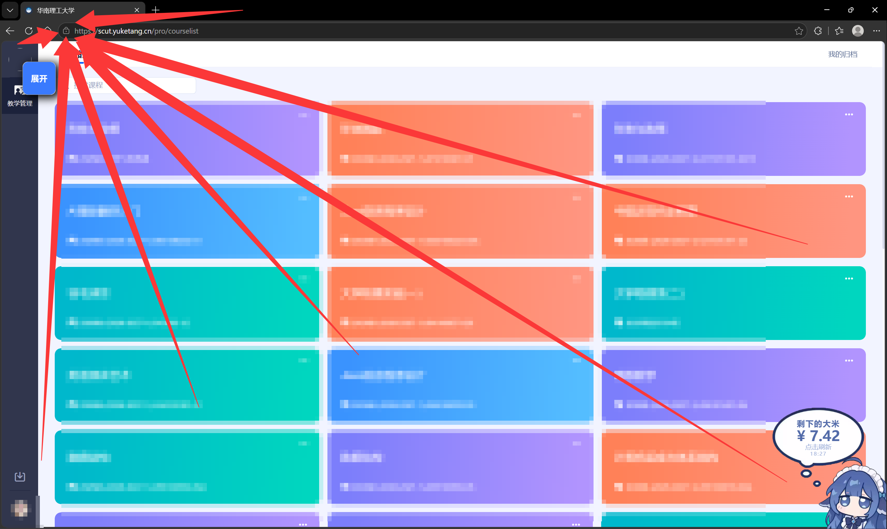
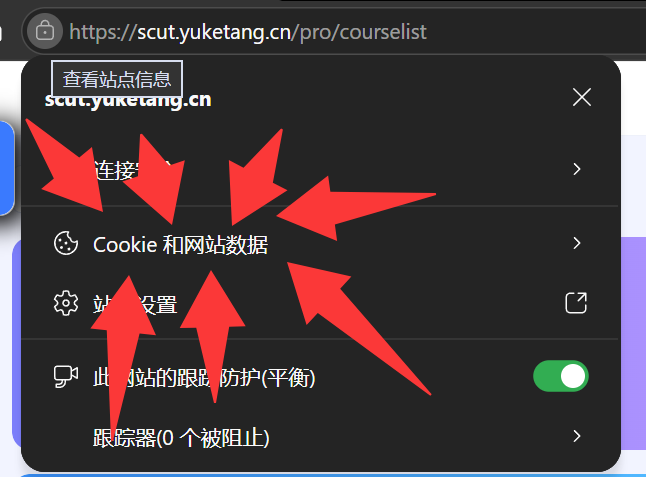
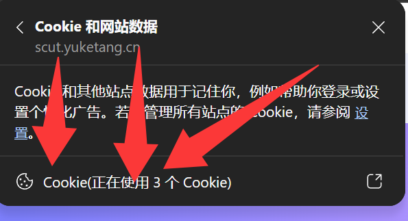
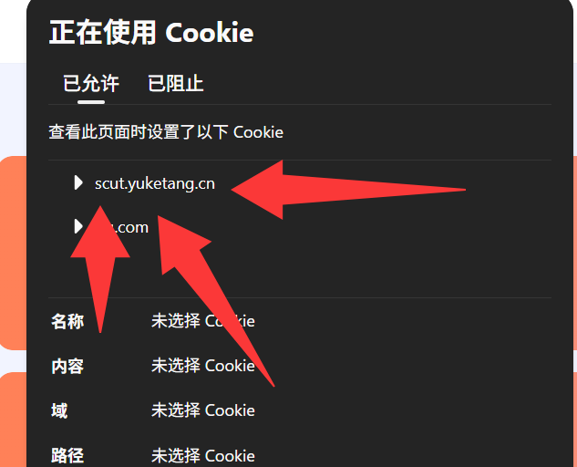
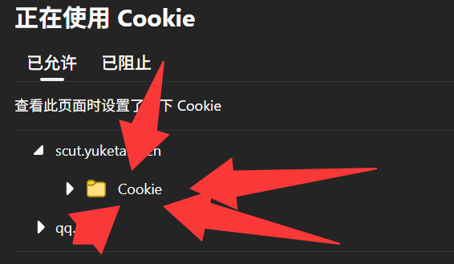
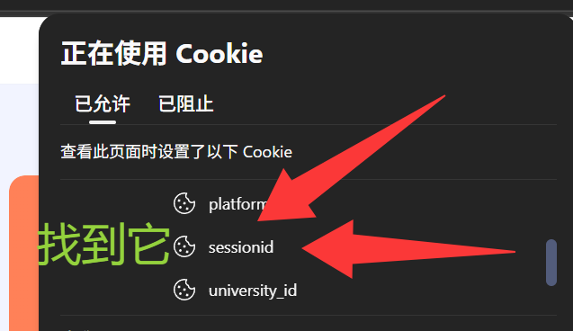
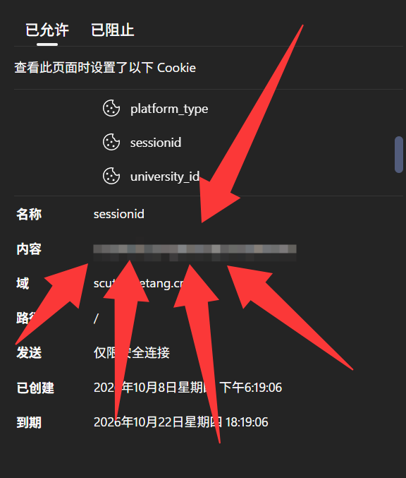
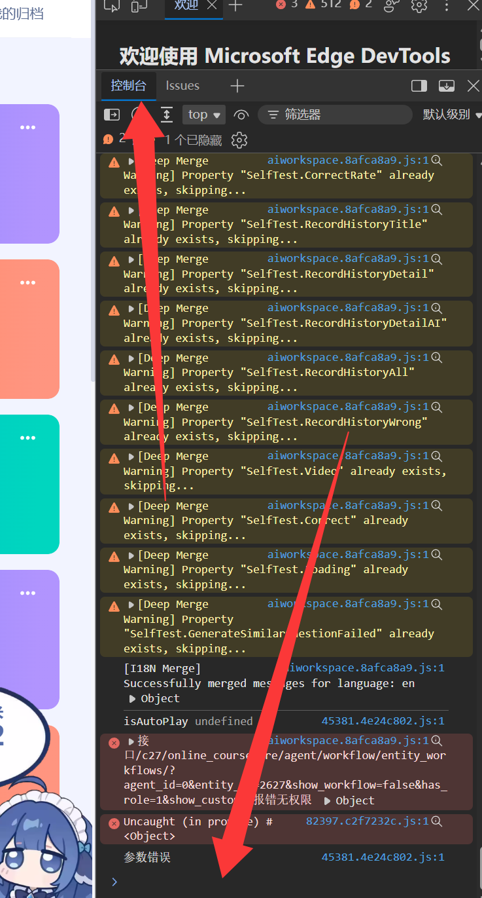
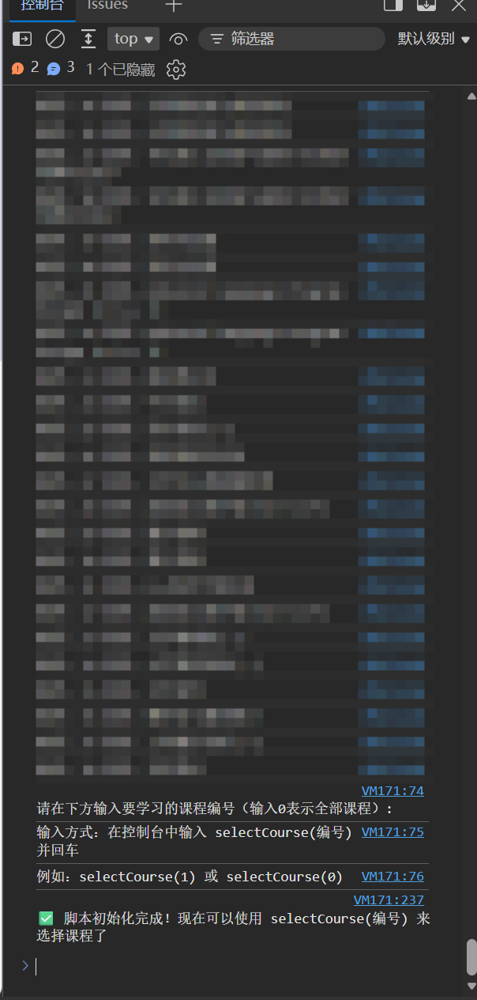

# 雨课堂刷课脚本使用教学

## 控制台版本

打开 `SCUT雨课堂_控制台版本.txt` 会看到以下内容（前几行）：

```这里填啥
(async function () {
    // 请在此处填写你的sessionid，这个sessionid在网址栏旁边的锁里面点击Cookie和站点数据，一路点下去找到名字为sessionid的Cookie，将内容粘贴到这里
    const sessionid = 'u139dek0r52ay3ezxvd177ni7pofnfiw';
    // 学习速率 我觉得默认的这个就挺好的
    const learning_rate = 4;
```

**一定要去改自己的 sessionid !!!!!!**

具体流程如下（以Edge为例）：



登录后来到这个页面，看到左上角网址旁边的锁，点开



再点击 `Cookie 和站点数据`




内容的这一串东西就是 `sessionid` 的要填的东西，把它复制了然后粘贴到 `SCUT雨课堂_控制台版本.txt` 的第三行的单引号里：

```这里填啥
const sessionid = '';
```

然后把所有代码按 `Ctrl+C` 复制下来（全选用 `Ctrl+A` ），回到网页按下 `F12`



保证上面是 **控制台** 然后点击下方的输入框，按下 `Ctrl+V` 粘贴代码并按下 `Enter` 使用



上面被马赛克遮住的那一块会显示课程名字和编号，然后跟着提示走，输入 `selectCourse(编号)` 并回车就行了

**再说不会操作就把你的姓名学号宿舍位置提到 `issue` 里，我顺着过去打你😡**
