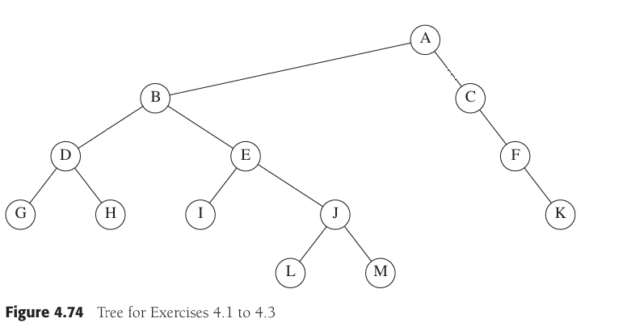
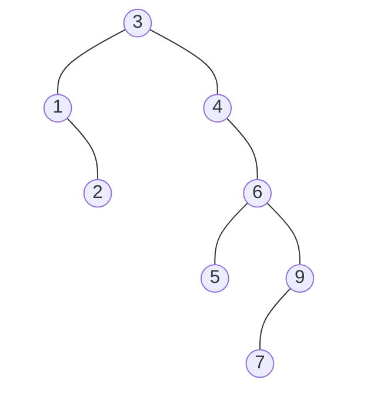
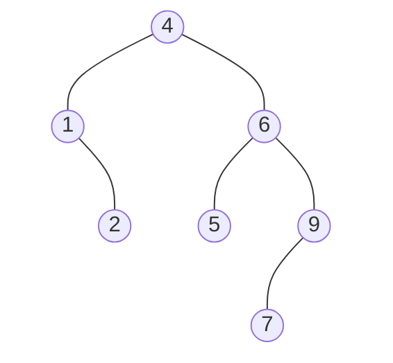

# 数据结构第三次作业

## 题目概要

Textbook Exercises 4.2,  4.9

## Exercise 4.2

For each node in the tree of Figure 4.74:

* a. Name the parent node.
* b. List the children.
* c. List the siblings.
* d. Compute the depth.
* e. Compute the height.

### Solution A

* 没有父节点； 子节点为B和C； 没有兄弟节点； 深度为0； 高度为4

### Solution B

* 父节点为A； 子节点为D和E； 兄弟节点为C； 深度为1； 高度为3

### Solution C

* 父节点为A； 子节点为F； 兄弟节点为B； 深度为1； 高度为2；

### Solution D

* 父节点为B； 子节点为G和H； 兄弟节点为E； 深度为2； 高度为1；

### Solution E

* 父节点为B； 子节点为I和J； 兄弟节点为D； 深度为2； 高度为2；

### Solution F

* 父节点为C； 子节点为K； 没有兄弟节点； 深度为2； 高度为1；

### Solution G

* 父节点为D； 没有子节点； 兄弟节点为H； 深度为3； 高度为0；

### Solution H

* 父节点为D； 没有子节点； 兄弟节点为G； 深度为3； 高度为0；

### Solution I

* 父节点为E； 没有子节点； 兄弟节点为J； 深度为3； 高度为0；

### Solution J

* 父节点为E； 子节点为L和M； 兄弟节点为I； 深度为3； 高度为1；

### Solution K

* 父节点为F； 没有子节点； 没有兄弟节点； 深度为3； 高度为0；

### Solution L

* 父节点为J； 没有子节点； 兄弟节点为M； 深度为4； 高度为0；

### Solution M

* 父节点为J； 没有子节点； 兄弟节点为L； 深度为4； 高度为0；

## Exercise 4.9

a. Show the result of inserting $3,1,4,6,9,2,5,7$ into an initially empty binary search tree.

b. Show the result of deleting the root.

### Solution A of 4.9

* BST的插法是比当前根节点大的往右放，小的往左放

~~我是真想不到怎么用markdown画个二叉树了~~

### Solution B of 4.9

* 上课讲的应该是使用右子树里面的最小节点来替代，所以我们观察右子树，发现在 $\{4, 6, 9, 5, 7\}$ 里面最小的节点是 $4$
* 然鹅 $4$ 节点没有左节点，所以直接把它的右节点扯下来就行了

