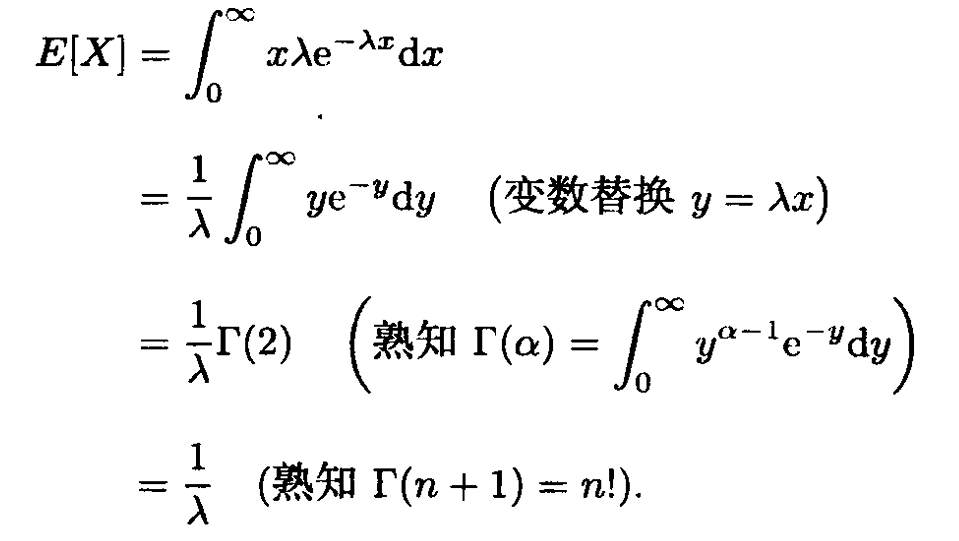

# 概率论与数理统计

嫌麻烦可以看飞书文档

> https://rcns607y2xyb.feishu.cn/docx/ATzUdFL4NoOpP2xImnzcTrWunth?from=from_copylink

# 前言

这个东西我是在考试前几天写的，上课没听课后没学所以严格来说不算上课笔记，只是在期末周勤奋啃课本写下来的东西罢了，所以也算是第一次学，如果有哪里写的不对的地方可以在评论指出，我会改的

# 第一章 随机事件与概率

这个东西高中考的也差不多了，能考上大学的这一章大概都没有啥要复习的

主要讲讲的就只有 **全概率公式** 和 **贝叶斯公式 **

## 基础

在一次试验中若A发生，则B也发生，我们称B包含A，记为 A⊂B

若 A⊂B 且 B⊂A 则称 A与B相等

A 的对立事件就是 **Ā**

条件概率：P\(A\|B\)表示在事件B发生的条件下A发生的概率，通常用$P(A|B)=\frac {P(AB)} {P(B)}$表示

接下来是事件的独立性，最简单的就是$P(A) = P(A|B)$ 表示事件B发生与否都不影响事件A的发生的可能性

然后∩和∪这两个运算就不用多说了也都懂

## 全概率公式与贝叶斯公式

因为是考前复习的就没必要写的太详细，不然会不方便理解

假设一个比较复杂的 A事件 会和其他不同时发生的 B1, B2事件 相联系

则有$P(A) = \sum P(AB_i) = \sum P(B_i)P(A|B_i)$ 差不多就是把分散在各个 $B_i$ 里面的 A 给拼起来

然后是 Bayes公式 ，是拿来计算 $P(B_i|A)$的

这个我们看到是条件概率，就想到拿$P(B_i|A) = \frac {P(AB_i)} {P(A)}$来算

那我们不妨在上面套一个条件概率，在下面套一个全概率公式得到 Bayes公式：

$P(B_j|A) = \frac {P(B_j)P(A|B_j)} {\sum P(B_i)P(A|B_i)}$ 这样就好看很多了

# 第二章 一维随机变量及其分布

我们首先将变量分为离散型和连续性两种

## 离散型

### 二项分布

如果一个随机变量 X 的取值为 0, 1, 2, 3, \.\.\., n, 我们称 X服从**二项分布 **

$P(X=k)= \binom{n}{k} p^k(1-p)^{n-k} ,k=0,1,2,...,n$ 记为 X\~B\(n,p\)

啊这里的$\binom n k$其实就是 $\large C_k^n$只是课本这么教就这么写吧

这里的B\(n,p\)表示进行了n次概率为p的**伯努利试验**（两点分布）

### 泊松分布

$P(X=k) = \frac{e^{-\lambda}\lambda ^ k} {k!},k=0,1,2,...,$ 记为 **X \~ Pois\(λ\)**

这个看起来会很抽象，因为这个实际上是泊松为了计算**n很大而p很小**的二项分布的近似分布的时候搞出来的

### 几何分布

这个东西和**伯努利试验**有关，是一次次独立做伯努利试验，直到第一次成功为止，我们可以很轻松的推出

$P(X=k) = (1-p)^{k-1} p,k=1,2,...$

## 连续型

连续性不像是离散型那样非黑即白的试验，一般这类试验的结果可能取全体实数值或者是实数轴上的一个区间，其分布函数可以写成另外一个函数的积分，此时随机变量的分布特性可以由一个**非负可积函数的积分**来表示，就比如说

$F_X(x) = {\int}\scriptsize{{x} \atop {-∞}}\normalsize f_X(t)dt, x \in(-∞,+∞)$

在这里这个X就是**连续型随机变量**，$f_X$就是X的**分布密度函数**

### 均匀分布

均匀分布表示这个X在\[a,b\]上处处等可能，其分布密度函数应该是

$f_X(x)=\begin{cases}
{\frac 1 {b-a}} &\text{如果} x ∈ [a,b] \\
{0}  &\text{如果} x∈ 其他
\end {cases}$

记作 **X \~ U\[a,b\]** ， 其分布函数为

$F_X(x) = \int_{-∞}^xf(t)dt = \begin{cases}
0,&当x<a\\
\frac {x-a}{b-a},&当a≤x≤b\\
1,&当x>b
\end{cases}$

这里有个阴的，如果不想算可以直接记均匀分布的方差是$D(X)=\frac{(b-a)^2}{12}$

### 指数分布

若X服从指数分布，则 X 的分布密度函数为

$f_X(x) = \begin{cases}
\lambda e^{-\lambda x},&当x>0,\\
0,&当x≤0,\\
\end{cases}$ 

记作 **X \~ Exp\(λ\) **，其分布函数为

$f_X(x)=\begin{cases}
1-e^{-\lambda x},&当x>0,\\
0,&当x≤0,\\
\end{cases}$

### 正态分布（最常见！）

但是这个也比较难记，其分布密度函数为

$f_X(x)=\frac {1}{\sqrt{2\pi}\sigma}e^{-\frac{{(x-\mu )}^2}{2\sigma ^2}},-\infty<x<+\infty$

其中的**μ**和**σ**都是参数，正态分布记为 **X \~ N\(μ，σ²\)**

特别的，有个东西叫标准正态分布，是 **X \~ N\(0，1\)**

对于标准正态分布，它的分布密度函数通常记为

$\phi(x)=\frac{1}{\sqrt{2\pi}}e^{-\frac{x^2}{2}}$

而分布函数通常记为

$\varPhi(x)=\frac{1}{\sqrt{2\pi}}\int_{-\infty}^{x}e^{-{\frac{t^2}{2}}}dt$

可以简单的看成这样的图，对称轴为μ，在x=a以左的区域，曲线与x轴围成的面积就是$\varPhi(a)$

所以不难发现有以下性质

$\begin{cases}
\varPhi(-x)=1-\varPhi(x)\\
P(a<X<b)=\varPhi(\frac{b-\mu}{\sigma})-\varPhi(\frac{a-\mu}{\sigma})
\end{cases}$

**~~我糙这个性质2十分甚至有九分强力啊！怎么推的？？？？~~**

这就是一个以后会经常用到的招 **正态分布标准化 **

对于一个服从正态分布的 $X\sim N(\mu,\sigma^2)$，在分布密度函数右上角那里一直有一坨$\frac{(x-\mu)^2}{2\sigma^2}$很是烦人

对比标准正态分布的$\frac{x^2}{2}$，我们可以直接设一个$Z=\frac{x-\mu}{\sigma}$，这样这个Z就服从标准正态分布了！

# 第三章 随机向量及其分布

这里开始会比较难懂，因为已经几乎不是高中知识了

这一章要主要是将原本一维的函数拓展到多维，在这里就以二维来讲

同样的，我们认为原本的事件X变成了一个拥有多个参数的向量

这里就会牵扯到两个很重要的东西：**联合分布与边缘分布**

（这个我在课上没听，课后作业都是问AI的U•ェ•\*U）

## 联合分布 \& 边缘分布

说的直白一点，联合分布是从**整体**视角来看的，只看X和Y同时出现的概率，而边缘分布会更**片面**一点，只看X和Y的其中一个

特别的，当X和Y相互独立的时候，我们有$f_{X,Y}(x,y)=f_X(x)f_Y(y)$

即联合密度分布=边缘密度分布之积

这么讲可能太抽象了点，我们像第二章那样，从离散型和连续型两个角度来讲

## 二维离散型随机向量

二维随机向量我们一般用（X，Y）表示，其取值为$(x_i,y_i),i,j=1,2,3,...$

分布列为$P(X=x_i,Y=y_i)=p_{ij}>0$

必有$\sum\sum p_{ij}=1$

那么这时候就这个整体的**联合分布函数**就是

$F_{X,Y}(x,y)=\sum_{x_i≤x,y_j≤y}p_{ij}$

差不多是这样，表示X≤x且Y≤y的那一块区域

### 举个例子（三点分布）

我们假设一个随机试验，有ABC三个结果，出现的概率分别是p, q, 1\-p\-q，现在记X和Y分别是n次试验中A和B发生的次数

这时候（X，Y）就是离散型的二维向量，由于每次试验是独立的，显然有$0≤i+j≤n$

那么由独立试验概型可以算出

$P(X=i,Y=j)=\binom n i \binom {n-i} j p^iq^j(1-p-q)^{n-i-j}$

而边缘分布是$X\sim B(n,p)，Y\sim B(n,q)$

这个边缘分布就是只考虑一个变量的分布，在离散型里面通常做法是将另一个变量加起来

就差不多是$p_{·j}=\sum_{i=1}^\infty p_{ij}$这个样子，那个不被考虑的变量我们拿一个点 · 来代替

## 二维连续型随机变量

其实这里跟一维是差不多的，我们从离散型已经知道了个大概了，但是如果点落的很密集我们没有办法通过简单的相加来求和，所以我们采取**积分**的方式来定义它的分布函数

$F_{X,Y}(x,y)=\int_{-\infty}^x\int_{-\infty}^yf_{X,Y}(u,v)dudv,(x,y)∈R^2$

这就要求分布密度函数必须要大于等于0，同时**分布密度函数对整个R²积分必须为1**

也会有$P((X,Y)∈D) =\iint_Df_{X,Y}(x,y)dxdy$

说白了这里就是单纯考你重积分能力的，拓展到n维就是n重积分

然后这里的$f_{X,Y}(x,y)$就是联合分布密度函数

至于边缘分布密度函数就简单的对其他不需要的变量给积分就行了，例如

$f_X(x)=\int_{-\infty}^\infty f_{X,Y}(x,y)dy$     $f_Y(y)=\int_{-\infty}^\infty f_{X,Y}(x,y)dx$

### 二维均匀分布

设D为二维平面上的一个有界区域，面积为$S_D$，若随机向量（X，Y）的分布密度函数为

$f_{X,Y}(x,y)=\begin{cases}
\frac{1}{S_D},&(x,y)\in D,\\
0,&其他,\\
\end{cases}$

则称（X，Y）服从D上的均匀分布，意思就是往D上随便丢一个点，这个落点（X，Y）服从D上的均匀分布

#### 举个例子

在某一分钟的任何时刻，两个信号进入收音机是等可能的，试求一分钟内两个信号的时间间隔小于0\.5秒的概率

由题有X和Y都服从U\[0,60\]且相互独立，那么就有（X，Y）服从从\(0,0\)到\(60,60\)这个矩形D的均匀分布

所求即为$P(|X-Y|<0.5)=\iint_{|x-y|<0.5}\frac 1 {3600}dxdy$

### 二维正态分布

这个说实话有点抽象，指的是X和Y的边缘分布都服从正态分布，我们直接假设$\begin{cases}
X\sim N(\mu_1,\sigma_1^2)\\
Y\sim N(\mu_2,\sigma_2^2)\\
\end{cases}$

则有$f_{X,Y}(x,y)=\frac 1 {2\pi\sigma_1\sigma_2\sqrt{1-\rho^2}}exp(-\frac1 {2({1-\rho^2})}(\frac{(x-\mu_1)^2}{\sigma_1^2}-2\rho\frac{(x-\mu_1)(y-\mu_2)}{\sigma_1\sigma_2}+\frac{(y-\mu_2)^2}{\sigma_2^2}))$

你放心吧这个多半不会考因为好难我自己都记不下来我赌出题老师不会为难我们的

记为$(X,Y)\sim N(\mu_1,\mu_2,\sigma_1^2,\sigma_2^2,\rho)$注意哦这个ρ也是个参数

啊你要是想的话也可以拓展到n维但是我懒得写了

### 条件密度函数

哈哈，既然谈到了两个变量，那就不得不提到条件密度这个东西了

我们考虑在已知$\set{Y=y}$发生的情况，X的条件分布：

由于这个Y是连续的，所以对于任意的Y都会有$P(Y=y)=0$，很棘手，但是我们可以考虑拿边缘分布密度来看，定义X的条件密度函数为

$f_{X|Y}(x|y)=\frac{f_{X,Y}(x,y)}{f_{Y}(y)}$， $\forall x \in R$

这个就是在Y=y的条件下了，在X=x的条件下同理，记得要换个位置

## 二维随机向量函数的分布

本关考验你重积分能力，会稍微的复杂一点，有可能是$Z=X*Y^3$之类的很膈应人的形式，我们这里只讨论$Z=X+Y$这种比较常见的形式（出题一般也不会难到哪里去）

### 离散型

离散型就简单得多了，Z的分布列可以简单的列成

$P(Z=z_k)=\sum_{x_i+y_j=z_k}p_{ij}$

这个分布列还可以根据X和Y的特殊情况来简化，比如说X与Y独立且$\begin{cases}
x_i=i\\
y_j=j\\
\end{cases}$的话就可以变成

$P(Z=k)=\sum_{i=0}^kP(X=i)P(Y=k-i)=\sum_{i=0}^kp_ip_{{(k-i)}}$

### 连续型

我们考虑$F_Z(z)=P(Z\le z)=P(X+Y\le z)=\iint_{x+y\le z}f_{X,Y}(x,y)dxdy$

可以写成$\int_{-\infty}^{\infty}dx\int_{-\infty}^{z-x}f_{X,Y}(x,y)dy$的形式

对$F_Z(z)$求导即可得到$f_Z(z)=\int_{-\infty}^{\infty}f_{X,Y}(x,z-x)dx$（这里是变上限积分求导要注意了）

特别的，如果X与Y独立，那么有$f_Z(z)=\int_{-\infty}^{\infty}f_X(x)f_Y(z-x)dx$

这个神秘命题就这么直接照搬下来吧，我目前不知道这个对考试有啥用

# 第四章 随机变量的数字特征

哎呀这里讲的就是一些什么期望方差之类的东西

这里和高中有一点不一样，我们有时候会用Var\[x\]表示方差，这点要注意了

哦对了还有标准差$\sigma[X]=\sqrt{Var[X]}$

## 期望

### 离散型

对于离散型变量，期望的公式为$E[X]=\sum_{i=1}^\infty x_i p_i$

接下来给出二项分布和泊松分布的期望

$X\sim B(n,p):E[X]=np\\
X\sim Pois(\lambda):E[X]=\lambda$

### 连续型

对于连续型变量，我们同样不是简单的相加，用积分$E[X]=\int_{-\infty}^{\infty}xf_X(x)dx$

这里要注意了，如果X是个函数（E\[g\(x\)\]这样的形式），不需要求出g\(X\)的分布密度函数

直接用$E[g(X)]=\int_{-\infty}^{\infty}g(x)f_X(x)dx$**（这个还是很重要的）**

接下来给出均匀分布，指数分布，正态分布的期望

$X\sim U[a,b]:E[X]=\int_a^bx\frac 1 {b-a}dx=\frac{a+b}2\\

X\sim Exp(\lambda):E[X]=\frac 1\lambda\\
X\sim N(\mu,\sigma^2):E[X]=\mu$

右侧是指数分布的证明，有俩需要记的东西，觉得可能会有点用就贴出来了

## 方差

一般方差都是根据期望来计算的$Var[X]=E[(X-E[X])^2]$，反映随机变量取值波动性的特征

但是实际上用的更多的是$\fcolorbox{red}{yellow}{$Var[X]=E[X^2]-(E[X])^2$}$

### 离散型

对于具有概率分布为$P(X=x_i)=p_i$的离散型随机变量X，方差为$Var[X]=\sum_{i=1}^\infty(x_i-E[X])^2p_i$

### 连续型

对于具有分布密度函数$f_X$的连续型随机变量X，方差为$Var[X]=\int_{-\infty}^\infty(x-E[X])^2f_X(x)dx$

## 矩

$X关于点c的k阶矩：E[(X-c)^k]$

其中X为随机变量，c为常数（在哪个点），k为正整数

**原点矩**：c=0

**中心矩**：c=E\[X\]

**偏度**：$\frac{E[(X-E[X])^3]}{\sqrt{(Var[X])}^3}$刻画X的偏斜程度

因为是两式相除，所以只需要看上面的正负性就可以判断是左偏还是右偏了

这个除以$\sqrt{(Var[X])}^3$是为了标准化，这样尺度不一样也差不多

显然正态分布的偏度为0

**峰度**：$\frac{E[(X-E[X])^4]}{{(Var[X])}^2}$峰度用来判断X在均值附近的陡峭程度，峰度越小，X的取值就越集中于E\[X\]附近

如果一个随机变量的峰度大于3，则称为是尖峰的（正态分布的峰度系数为3）

## 协方差

协方差是仅对**二维随机向量**生效的，不要搞混了！

上面用来写一维了，二维我们一次性全搞定，先从期望搞起

**离散型期望**$E[g(X,Y)]=\sum_{i=1}^\infty\sum_{j=1}^\infty g(x_i,y_j)p_{ij}$

**连续型期望**$E[g(X,Y)]=\iint_{R^2}g(x,y)f_{X,Y}(x,y)dxdy$

**协方差**$Cov(X,Y)=E[(X-E[X])(Y-E[Y])]=\colorbox{yellow}{E[XY]-E[X]E[Y]}$

**相关系数**$r(X,Y)=\frac{Cov(X,Y)}{\sqrt{Var[X]}\sqrt{Var[Y]}}$，若$r(X,Y)=0$则称X与Y**不相关**

这个相关系数一定是在\[\-1,1\]上的

右侧是课本上给的一个定理，但是考试没见考过

## 期望，方差，协方差的运算性质

### 期望

常数的期望等于自己就不用说了这个谁都懂

**线性性：**$E[aX+bY]=aE[X]+bE[Y]$

如果X与Y**相互独立**或X与Y**不相关**，则$E[XY]=E[X]E[Y]$

### 方差

常数的方差为0这个也不用说，因为取值不会变，分散程度当然是0

如果X与Y**相互独立**或X与Y**不相关**，则$Var[aX+bY]=a^2Var[X]+b^2Var[Y]$

哦对了怕你们不是很理解上面这一条，这里如果在Var里面加了一个常数就会被直接忽略，如果只是$Var[aX]$的话就等于$a^2Var[X]$

### 协方差

协方差的值和里面XY的顺序没有关系

**双线性性**：$Cov[aX+bY,Z]=aCov[X,Z]+bCov[Y,Z]\\
Cov[Z,aX+bY]=aCov[Z,X]+bCov[Z,Y]\\$虽然都差不多，根据这个好像还可以搞个分配律，但是课本上没有就当不考了

## 条件数学期望

这个也是对二维随机向量而言的

**离散型**：$E[X|Y=b_j]=\sum_{i=1}^\infty a_iP(X=a_i|Y=b_j)$

**连续型**：$E[X|Y=y]=\int_{-\infty}^\infty xf_{X|Y}(x|y)dx$

啊当然如果X和Y相互独立的时候，条件分布就和各自的边缘分布相同了，这时候条件期望就跟滚木一样了

$E[X|Y]=E[X],~~E[Y|X]=E[Y]$

对应全概率公式，这里还有$E[E[X|Y]]=E[X],~~E[E[Y|X]]=E[Y]$

特别的，如果服从二维正态分布$(X,Y)\sim N(\mu_1,\mu_2,\sigma_1^2,\sigma_2^2,\rho)$，则$E[X|Y]=\mu_1+\rho\frac {\sigma_1} {\sigma_2}(X-\mu_2)\\
E[Y|X]=\mu_2+\rho\frac {\sigma_2} {\sigma_1}(Y-\mu_1)$

# 第五章 大数定律和中心极限定理

开幕雷击，这个定义我看半天没看懂，但是也没打算去背，下面给了挺多大数定律的所以我就懒得去看这个强和弱了

## 弱大数定律

### 切比雪夫大数定律

这里要提到**切比雪夫不等式**：设随机变量X的方差存在，则对于任意$\epsilon>0$有$P(|X-E[X]|\ge\epsilon)\le\frac{Var[X]}{\epsilon^2}$

切比雪夫大数定律：随机变量序列独立，$\colorbox{yellow}{$Var[X_i]\le C（方差有界）$}$则对任意$\epsilon>0$有

$\lim_{n\to\infty}P(|\frac{X_1+X_2+...+X_n}{n}-\mu|\ge\epsilon)=0$

提一嘴，课本上没写，这个$\mu$是指$E[\frac{\sum_{i=1}^nXi}{n}]=\frac1n\sum_{i=1}^nE[X_i]$，所以这里的每一个$X_i$可以不是同分布的

意思就是当n足够大的时候，所有样本的均值会趋近于各自期望的均值

### 辛钦大数定律

随机序列独立同分布，各自期望$\mu$有界（其实切比雪夫那里也应该要求期望有界，因为要求是$\lim_{n\to\infty}\frac1nE[X_i]=\mu$就说明这个$E[X_i]$必须是收敛的），则对于任意$\epsilon>0$有

$\lim_{n\to\infty}P(|\frac{X_1+X_2+...+X_n}{n}-\mu|\ge\epsilon)=0$

### 伯努利大数定律

记$\nu_n$为n重伯努利试验中成功的次数，p为一次试验成功的概率，则有$\lim_{n\to\infty}P(|\frac{\nu_n}n-p|\ge\epsilon)=0$

意思是差不多的啊，根据辛钦大数定律可以证明，因为$\nu_n$的每一次试验都是伯努利试验，是独立同分布的

## 强大数定律

### 柯尔莫哥洛夫大数定律

课本不加证明我也不加证明了，以后哪个读者看到了可以加一下

**柯尔莫哥洛夫不等式**：随机变量序列独立，期望方差有界，$\forall\epsilon>0$有$P(\sup_{1\le k\le n}|\sum^k_{i=1}(X_i-E[X_i])|\ge\epsilon)\le\frac{\sum^n_{k=1}Var[X_k]}{\epsilon^2}$这个也不需要记，是拿来推大数定律的

柯尔莫哥洛夫大数定律：随机变量序列独立，期望有界，$\sum^\infty_{n=1}\frac{Var[X_n]}{n^2}<\infty$，则

$P(\lim_{n\to\infty}n^{-1}\sum^n_{k=1}(X_k-E[X_k])=0)=1$

或者当这个序列独立同分布的时候，甚至不需要方差有界，只需要期望有界就行了

### 博雷尔大数定律

伯努利试验又出场了$P(\lim_{n\to\infty}\frac{\nu_n}n=p)=1$，这里稍微变了变形，毕竟所有的$E[X_k]$都等于$p$

## 中心极限定理

随机变量序列具有有限的期望与方差，若满足$\frac{\sum^n_{k=1}(X_k-E[X_k])}{\sqrt{Var[\sum^n_{k=1}X_k]}}\xrightarrow{d}N(0,1)$则称这个变量序列服从中心极限定理（这里的$\xrightarrow{d}$表示依分布收敛，因为左右两边都是随机变量，不考，知道就行）

### 林德伯格\-莱维定理

随机变量序列独立同分布，期望方差有界，则服从中心极限定理，即$\lim_{n\to\infty}P(\frac1{\sigma\sqrt n}[\sum^n_{k=1}X_k-n\mu]\le x)=\frac1{\sqrt{2\pi}}\int^x_{-\infty}e^{-\frac{u^2}2}du$

说白了就是当n很大的时候只要这个随机变量序列是同分布的，不管是什么分布都可以拿正态分布来代替（当然是近似代替）

### 棣莫弗\-拉普拉斯定理

依旧伯努利试验，随机变量序列同服从$B(1,p)$，则服从中心极限定理，即$\lim_{n\to\infty}P(\frac1{\sqrt {np(1-p)}}[\sum^n_{k=1}X_k-np]\le x)=\frac1{\sqrt{2\pi}}\int^x_{-\infty}e^{-\frac{u^2}2}du$

### 举个例子

用课本上的例子吧

那这样每个\[每天看电影者\]就服从$B(1,\frac34)$且相互独立

那么假设这个座位数应该是m，根据题意就应该有$P(\sum^{1600}_{i=1}X_i\le m-200)\le0.1$，既然要求座位尽可能多那么就取等呗

我们直接写“根据棣莫弗\-拉普拉斯定理，n=1600足够大，可以近似作为正态分布计算，其中$np=1600\times\frac34=1200$，$\sqrt{np(1-p)}=10\sqrt3$”

故$P(\sum^{1600}_{i=1}X_i\le m-200)=P(\frac{\sum^{1600}_{i=1}X_i-np}{\sqrt{np(1-p)}}\le\frac{m-200-np}{\sqrt{np(1-p)}})\approx\varPhi(\frac{m-200-np}{\sqrt{np(1-p)}})$

啊当然这里不能偷懒只写np，你要把真的数值给代进去才行哦！我这里写是方便理解

然后最后一步就是把那个约等于出来的$\varPhi(\frac{m-200-np}{\sqrt{np(1-p)}})$查表得到具体数值写上去

# 第六章 数理统计的基本概念

这一段开头讲的比较迷糊，差不多意思就是我们之前讲的都是随机变量，现在在观测这个随机变量的时候，它会有一个具体的观测值，这个观测值就是**样本**

## 常见的统计量

**样本均值：**$\overline X=\frac1n\sum^n_{i=1}X_i$

**样本方差：**$S_n^2=\frac1n\sum^n_{i=1}(X_i-\overline X)^2$这里还有一个**修正样本方差**是$S_n^{*2}=\frac1{n-1}(X_i-\overline X)^2$

**样本k阶原点矩：**$\overline{X^k}=\frac1n{\sum^n_{i=1}X_i^k}$

**样本k阶中心矩：**$\frac1n\sum^n_{i=1}(X_i-\overline X)^k$

**顺序统计量：**说白了就是把样本**从小到大排序**然后组成一个新的样本，重新组合的第一位用$X_{(1)}$表示

**样本中位数：**就是顺序统计量中间的样本，如果总数是偶数就取$X_{(\frac n2)}$和$X_{(\frac n2+1)}$的均值

**样本极差：**顺序统计量的最大减最小$R_n^X=X_{(n)}-X_{(1)}$

## 经验分布函数

这个我看着像是跟高中学的什么经验回归方程差不多，给出一定的样本点然后那一个分布函数去拟合（？

$F^X_n(x)=\begin{cases}
0,&x<x_{(1)},\\
\frac1n,&x_{(1)}\le x<x_{(2)},\\
...\\
\frac kn,&x_{(k)}\le x<x_{(k+1)},\\
...\\
1,&x\ge x_{(n)},\\
\end{cases}$

然后这个$F^X_n(x)$和$F_X(x)$当n足够大的时候可以近似

## 样本均值与方差的特征

假设一个总体X有n个样本，$E[x]=\mu,Var[X]=\sigma^2$，那么会有

$\begin{gather}
E[\overline X]=\mu,~~~Var[\overline X]=\frac{\sigma^2}n\\
E[S^2_n]=\frac{n-1}n\sigma^2,~~~E[S_n^{*2}]=\sigma^2
\end{gather}$

## 三种概率分布（必考！！！）

### χ²分布（卡方分布）

先提一个前提条件，若$X\sim N(0,1)$则$X^2\sim\Gamma(\frac12,\frac12)$

然后是有关$\Gamma$分布，如果$X\sim\Gamma(\alpha,\lambda)$则X的分布密度函数为$f_X(x)=\begin{cases}
\frac{\lambda^\alpha}{\Gamma(\alpha)}x^{\alpha-1}e^{-\lambda x},&x>0,\\
0,&其他.
\end{cases}$

这里的这个Γ函数可以当成是**阶乘**拓展到正数上$\Gamma(\alpha)=\int_0^\infty x^{\alpha-1}e^{-x}dx~~(\alpha>0)$

然后Γ分布的$E[X]=\frac\alpha\lambda,~~Var[X]=\frac\alpha{\lambda^2}$

然后步入正题，是我们的卡方分布，如果$X\sim\Gamma(\frac n2,\frac12)$，那么我们说X服从自由度为n的${\chi^2}$分布

其分布密度函数为$f_X(x)=\begin{cases}
\frac1{2^n\Gamma(\frac n2)}x^{\frac n2-1}e^{-\frac x2},&x>0;\\
0,&其他.
\end{cases}$

有以下性质：

$E[X]=n,~~Var[X]=2n.
$

线性性$X_1+X_2\sim\chi^2(n_1+n_2)$

$\lim_{n\to\infty}\frac{X-n}{\sqrt{2n}}\sim N(0,1)$（中心极限定理）

### t 分布

这个是综合一点的，首先设$X\sim N(0,1),Y\sim\chi^2(n)$且相互独立，令$T=\frac X{\sqrt\frac Yn}$

那么这个T的分布密度函数就是

$f_T(x)=\frac{\Gamma(\frac{n+1}2)}{\sqrt{n\pi}\Gamma(\frac n2)}(1+\frac {x^2}2)^{-\frac{n+1}2}$

记作$X\sim t(n)$

$E[X]=0~(n>1),~~Var[X]=\frac2{n-2}~(n>2)$

当然会有中心极限定理

$\lim_{n\to\infty}t(n)\sim N(0,1)$

### F 分布

搞那么多分布出来恶心人是为啥？？？

设$X\sim\chi^2(m),~Y\sim\chi^2(n)$且相互独立，令$Z=\frac{\frac Xm}{\frac Yn}$则Z服从**第一自由度为m，第二自由度为n的F分布**$Z\sim F(m,n)$这个分布密度函数为

$f_Z(x)=\begin{cases}
\frac{\Gamma(\frac{m+n}2)}{\Gamma(\frac m2)\Gamma(\frac n2)}m^{\frac m2}n^{\frac n2}\frac{x^{\frac m2-1}}{(mx+n)^{\frac{(m+n)}2}},&x>0\\
0,&x\le0\\
\end{cases}$

这个性质很水，只有一个

若$Z\sim F(m,n)$则$\frac1Z\sim F(n,m)$

## 分位数

在题目中会很常见，已知X的分布，需要知道X小于等于哪个数的概率为α，这个数就是X的α分位数（这个高中有讲一点）

我们通常记为$P(X\le\psi_\alpha(n))=\alpha$，这里的$\psi$是随便一个分布，n是它的自由度

当然啊这里是需要查表的，正态分布的表可以相互转，就像$u_\alpha=1-u_{1-\alpha}$

注意了！上面讲过t分布和卡方分布在n很大的时候近似服从正态分布，所以这两个都可以转成正态分布然后查正态分布的表$\begin{cases}
\chi^2_\alpha(n)\approx u_\alpha\sqrt{2n}+n\\
t_\alpha(n)\approx u_\alpha
\end{cases}$

对于$F(m,n)$分布，有$F_\alpha(m,n)=\frac1{F_{1-\alpha}(n,m)}$

## 正态总体的抽样分布

如果总体$X\sim N(0,1)$，则均值$\overline X\sim N(0,\frac1n)$，样本方差$nS_n^2\sim\chi^2(n-1)$并且均值与方差相互独立

然后还有下面这一大坨推论，后面做到题如果有需要再看看

**我糙这个6\.3\.1推论十分甚至九分重要啊**，24级概率论考了这一点，这个是拿来判断正态总体的分布的，要记下来哦

# 第七章 参数估计

## 矩法估计（MOM）

当样本容量较大的时候，样本k阶矩和总体k阶矩差别很小，所以就可以拿样本k阶矩估计总体k阶矩

设总体$X\sim F_X(·,\theta)$，我们通常用$\hat\theta_M$来当成θ的**矩法估计量**，是一个函数（随机变量），将样本观测值代入算的的数值就是θ的**矩法估计值**

这么说有点抽象，解题流程大概是这样的：

假设题目服从一个神秘分布，就拿泊松分布来举例吧$X\sim Pois(\lambda)$求λ的矩估计

第一步就是先算出X的期望是$E[X]=\lambda$，这个期望就是总体矩

第二步是算样本矩，求出样本的均值

第三步是令样本矩等于总体矩然后解方程，解出来的λ就是均值，所以均值就是参数λ的矩估计

**诶这时候我要问了，如果有两个参数怎么办？？？就比如说**$X\sim U[a,b]$

也是差不多的，先算总体矩再算样本矩，最后联立解方程，只是有两个参数就要有两个方程

我们可以一阶矩列一个方程（期望=均值），二阶矩列一个方程（方差=方差）

**不对的不对的！如果一阶矩（期望）和参数无关怎么办？？？？？比如**$f_X(x,\theta)=\frac\theta2e^{-\theta|x|}$

那你就换一个矩，可以试着给X套一个绝对值，去列$E[|X|]=\frac1n\sum|X_i|$

## 最大似然估计（MLE）

同样的，都是要找那个θ，最大似然估计考虑的是导致这组数据发生概率最大的θ

我们定义一个**似然函数**$L(\theta)=\prod^n_{i=1}f_X(x_i,\theta)$，然后求这个函数的最大值点

都看到这里了应该都知道最大值怎么求吧，求导，导数为0啥啥啥的，当然这个很多个东西相乘不是很好搞

所以可以先对这个似然函数取对数，就变成了$\ln L(\theta)=\sum\ln f_X(x_i,\theta)$然后两边对θ求导就行了

**哦对了**最大似然估计量我们通常记为$\hat\lambda_L$

## 好还是坏？

都是估计方法了，肯定会有偏差，所以在这里我们要探讨一个估计方法是好还是坏

第一个是无偏估计量，怎么界定这个无偏还是有偏？我们通常认为如果一个估计量的期望和总体的期望相同，则这个估计量为**无偏估计量**

这里有一个前面的伏笔需要回收：

**样本方差：**$S_n^2=\frac1n\sum^n_{i=1}(X_i-\overline X)^2$这里还有一个**修正样本方差**是$S_n^{*2}=\frac1{n-1}(X_i-\overline X)^2$

为什么还要搞一个修正样本方差？因为$E[S^2_n]=\frac{n-1}n\sigma^2$是有偏的！而修正样本方差是无偏的！

本关考验你期望计算功夫，对于$X\sim U[0,\theta]$，我们会得到$E[\hat\theta_M]=\theta,~E[\hat\theta_L]=\frac n{n+1}\theta$，所以这里最大似然估计是**渐进无偏**，而矩法估计是无偏，所以我们需要令$\hat\theta=\frac{n+1}n\hat\theta_L$这样就是无偏了

回到一开头的问题，哪个比较好？我们当然可以认为方差越小的就越好

$Var_\theta[\hat\theta_M]=\frac{\theta^2}{3n},~Var_\theta[\hat\theta]=\frac{\theta^2}{n(n+2)}$（计算过程略了，这里计算量会比较大）

显然当n\>1的时候后者更小，所以我们认为$\hat\theta$会更好

当然了我们还定义了最有效的无偏估计量，我们叫它**一致最小方差无偏估计量（UMVUE）**，这个要求$Var_\theta[T_0]\le Var_\theta[T]$当然这个考试不考就不用看，因为考场上没时间给你找那么多

## 参数的区间估计（难点）

这里我们就要提到一个很重要的概念：置信度为$1-\alpha$的区间（或称置信区间）

首先我们知道样本均值$\overline X$是在$\mu$周围波动的，但是我们只能看得到$\overline X$，那我们就在$\overline X$左右两边延伸一点，让这个$\mu$在这个区间里面的概率很大就行了，那么这个很大的概率就是$1-\alpha$，称为**置信度**，然后这个延伸的距离一般就要我们去算出来

题目只能出估计方差或者估计期望

这样，先把一图流放上来

### 解题流程

一般分四步

1\.构造一个包含有$\overline X$和$\mu$（这个$\mu$是要估计的量）的式子，并且这个式子会服从一个分布（标准正态，t，卡方，F）

2\.给出置信度$1-\alpha$，查表找临界值

3\.列不等式，让这个式子在临界值之间

4\.解不等式，把这个$\mu$单独解出来就行了

### 情况1\.方差已知

这是课本上给的标准解题方法，不同的情况最大的区别就是需要把这个包含有$\overline X$和$\mu$的式子给列出来

### 情况2\.方差未知

这个就麻烦了，方差不知道我们不能直接列出来，但是还好啊我们有样本参数，我们知道$S_n^2$这个样本方差，但是这时候就不是正态分布了，所以我们可以考虑t分布

$\frac{\overline X-\mu}{S_n}\sqrt{n-1}\sim t(n-1)$

然后下面的查表流程都差不多

### 情况3\.期望已知

这里会稍微变一下，但是毕竟期望已知，我们列的是含有$\overline X$和$\sigma$的式子

### 情况4\.期望未知

这里我们就考虑卡方分布$\frac{nS^2_n}{\sigma^2}\sim\chi^2(n-1)$，然后后面的查表流程也是一样的

## 两个参数？？？

不急啊，两个参数也是分四种情况的，但是一定要要求X和Y相互独立才可以哦😋

分为四个类：估计期望相减，方差已知/未知但是相等；估计方差相除，期望已知/未知

### 情况1

也是同理的啊，只是我们要先相减把这个$\mu_1-\mu_2$和$\overline X - \overline Y$构造出来

### 情况2

因为这里方差是相等的，我们跟单参数一样，可以考虑拿$S_w$来代替共同的方差

哦对了这个$S_w=\sqrt{\frac{(m-1)S_1^{*2}+(n-1)S_2^{*2}}{m+n-2}}=\sqrt{\frac{mS_{1m}^2+nS_{2n}^{2}}{m+n-2}}$是**合并样本标准差**

### 情况3

现在要开始求$\frac{\sigma^2_1}{\sigma^2_2}$的区间估计了

### 情况4

那如果这个$\mu_1,\mu_2$都不知道，就不用硬套方差的公式了，所以我们考虑拿$S^2_{1m},~S^2_{2n}$来代

推论6\.3\.3：两个独立正态总体的**样本方差**之比\***真实方差的反比**服从F分布

## 非正态总体参数的区间估计

正态总体那一节太麻烦了，历年考试题也没有，直接不讲了

但是对于非正态的总体（例如服从泊松分布啥的），根据中心极限定理，当样本容量很大的时候可以近似成正态分布

$\frac{\overline X-E[X]}{S_n}\sqrt n\sim N(0,1)$

# 第八章 假设检验

这一章真真假假有点烦人了，这个在高中好像有个讲的什么独立性检验？差不多是这个东西

放心了，这里的公式没啥要背的，基本都是第七章的内容搬过来

先定一个命题$H_0$然后考虑接受/拒绝这个命题

首先我们要讲的是两类错误，**第一类错误**（拒真错误）和**第二类错误**（受伪错误）

顾名思义，第一类就是在$H_0$为真的时候拒绝$H_0$，第二类就是在$H_0$为假的时候接受$H_0$

我们一般认为$H_0$为真来检验（显著性检验），所以如果我们想对某一猜测做支持的话，就需要拿这个结论的反面作为$H_0$

## 正态总体参数

我们来试试检验，就拿统计量$\frac{\overline X-\mu_0}{\sqrt{\frac{\sigma^2_0}n}}\sim N(0,1)$，接下来这个总体有一系列样本，讨论如何应对假设$H_0:\mu\le\mu_0,~H_1>\mu_0$

首先在$H_0$下$\mu$的取值没有办法确定，但是可以拿$H_0$给的条件来列一个不等式

$\alpha=P(\frac{\overline X-\mu}{\sqrt{\frac{\sigma^2_0}n}}\ge u_{1-\alpha})\ge P(\frac{\overline X-\mu_0}{\sqrt{\frac{\sigma^2_0}n}}\ge u_{1-\alpha})$

所以当$\frac{\overline X-\mu_0}{\sqrt{\frac{\sigma^2_0}n}}\ge u_{1-\alpha}$的时候就可以拒绝$H_0$，犯第一类错误的概率不超过$\alpha$

这个表是各种$H_0$的假设情况

👆这里μ1，μ2已知的公式错了，上下应该要除以自由度才符合F分布

然后是课本上的例题，这个跟考试出的题没啥太大区别，看看过程得了

## 非正态总体均值

哎呀这个非正态老生常谈了，用近似分布给拒绝域，样本容量要大，然后你既然都近似分布了，那这个构造方法就和正态总体参数的构造方法完全一样了，只是你那个$H_0$不能写$\mu\ge\mu_0$，要用$E[X]$代替$\mu$

## 卡方检验

这个就是高中东西了，什么抽烟与得肺癌相不相关啥的

我们只考虑一般分布的卡方拟合检验，这个考的可能多一点

这个拟合校验就是问你这个样本数据是否可以认为是正态分布

首先先算出参数：**样本均值**和**样本方差**

然后分组，就像是什么$[\mu,\mu-\sigma^2]$之类的组，至少分六个

然后把题目给的数据丢到这些组里面看频数$\nu_i$

你都已经假设它是正态分布了，那你就要查表把这个理论概率算出来，就是在$H_0$的正态分布下在每个区间的概率是如何，记为$\hat p_i$

第五步是套公式$\hat K=\sum^k_{i=1}\frac{(\nu_i-n\hat p_i^0)^2}{n\hat p_i^0}$这个是服从卡方分布的

第六步就是查卡方分布的临界值，自由度为**分组数\-估计的参数数\-1**

假设分了六个组，估计是正态分布$N(\mu,\sigma^2)$有两个参数，那么查的就是$\chi^2_{1-\alpha}(6-2-1)$，如果比你套公式出来的大就不能拒绝，比你算出来的小就要拒绝

# 第九章 R软件考都不考我复习个蛋

# 刷真题遇到的一些题目

